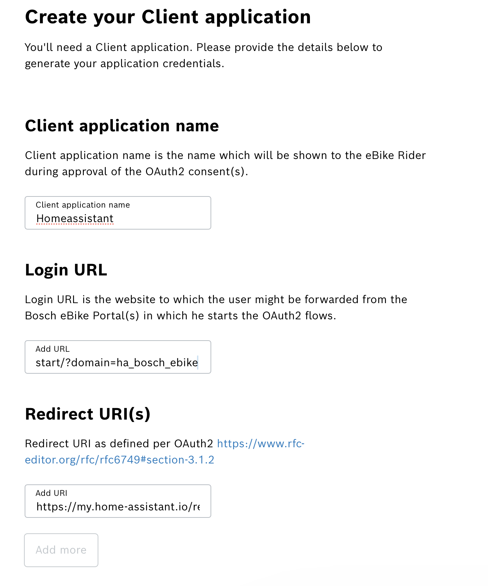
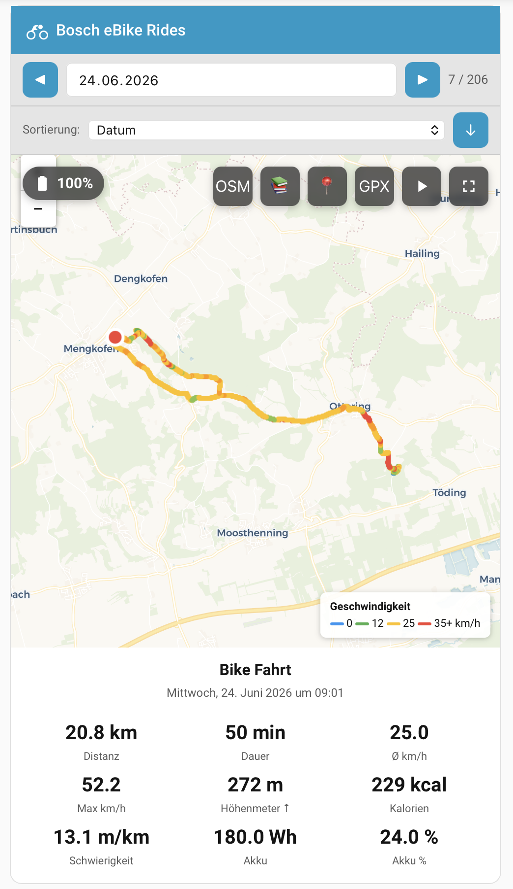
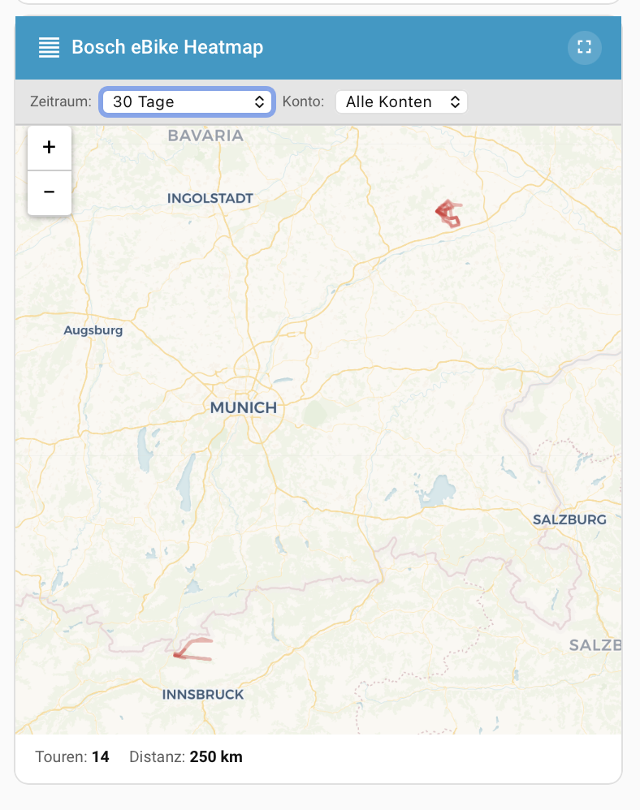
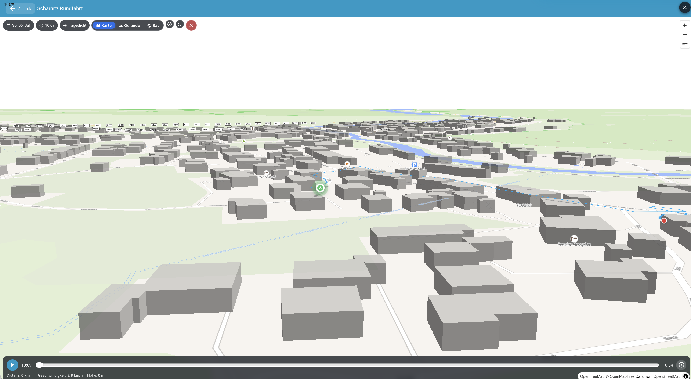
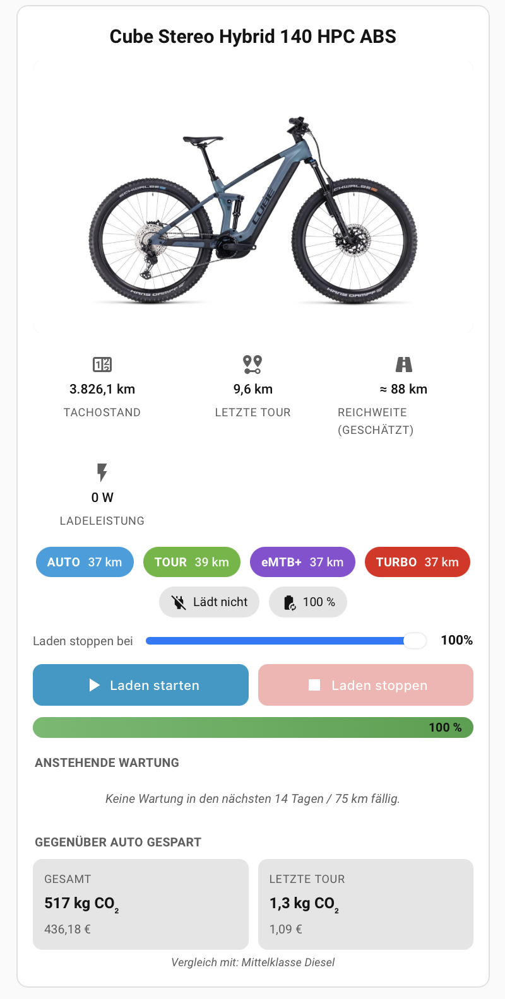

# Bosch eBike Smart System – Home Assistant Integration

[](https://github.com/hacs/integration)
[](https://www.home-assistant.io/)
[](https://my.home-assistant.io/redirect/hacs_repository/?owner=Xunil99&repository=ha-bosch-ebike&category=integration)

> **Deutsch** | [English](#english) | [Nederlands](https://github.com/Xunil99/ha-bosch-ebike/blob/main/README.nl.md) | [Français](https://github.com/Xunil99/ha-bosch-ebike/blob/main/README.fr.md) | [Italiano](https://github.com/Xunil99/ha-bosch-ebike/blob/main/README.it.md) | [Español](https://github.com/Xunil99/ha-bosch-ebike/blob/main/README.es.md)

> **Bosch eBike Smart System & eBike System 2 (BES2) für Home Assistant** – liest Fahrrad- und Fahrtdaten direkt von der offiziellen Bosch Data Act API: Kilometerstand, Akkuzustand, letzte Fahrten mit GPS-Track und mehr. Mit Custom-Lovelace-Karten (2D, 3D, Heatmap, Kalender, Routenplaner, Dashboard) und optionalen Live-Daten per Bluetooth.
>
> *Bosch eBike Smart System & eBike System 2 (BES2) for Home Assistant – reads bike and ride data directly from the official Bosch Data Act API, with custom Lovelace cards and optional live data over Bluetooth.*

> **⚠️ Update-Hinweis (ab v1.17.6):** Der Integrationsordner heißt jetzt `ha_bosch_ebike` (vorher `bosch_ebike`). Deine Einrichtung, Geräte und Einstellungen bleiben unverändert. Falls nach dem HACS-Update **beide** Ordner in `config/custom_components/` liegen, lösche den alten `bosch_ebike` einmalig und starte Home Assistant neu.

> ### ⚠️ Regionale Voraussetzung
> Diese Integration funktioniert **ausschließlich mit einem Bosch SingleKey-ID-Konto, das innerhalb der EU registriert ist**. Sie nutzt die offizielle Bosch Data Act API, deren Verfügbarkeit auf EU-Konten beschränkt ist. Konten aus anderen Regionen werden vom API-Endpoint abgelehnt und die Integration kann sich nicht anmelden.

> ### 🔌 Echte Live-Daten per Bluetooth (smart system v19+)
> Dieses Repo enthält neben der HACS-Integration auch eine **ESPHome-BLE-Bridge**, die einen ESP32 zur Brücke zum **Bosch eBike Live Data Interface** macht. Damit fließen Akku-SoC, Speed, Tachostand & Co. in Echtzeit nach Home Assistant.
>
> 🚀 **Flashen ohne ESPHome-Setup**: ESP32 (oder ESP32-C3, z. B. "C3 Mini") per USB anstecken und in Chrome / Edge **[https://xunil99.github.io/ha-bosch-ebike/](https://xunil99.github.io/ha-bosch-ebike/)** öffnen, *Install* klicken. Der Installer erkennt den Chip automatisch und flasht die passende Firmware. WLAN-Setup läuft im selben Browser-Schritt. Vollständige Anleitung (DE/EN) inkl. Pairing über die Flow App: [`esphome/`](https://github.com/Xunil99/ha-bosch-ebike/tree/main/esphome).
>
> *Real live data via Bluetooth: ESP32 firmware can be flashed directly from your browser at the link above, no ESPHome installation required. Bilingual guide in [`esphome/`](https://github.com/Xunil99/ha-bosch-ebike/tree/main/esphome).*

> ### 🖥️ Optional: 4,3"-Display für Datum, Wetter und Live-Daten
> Zusätzlich zur Bridge gibt es jetzt eine zweite Firmware für das **Guition/Sunton JC4827W543** (ESP32-S3 mit 4,3" IPS-Touch). Sie liest die Bridge-Sensoren aus Home Assistant, zeigt Datum, Uhrzeit, Wetter und bis zu zwei eBikes parallel an. Bestehende Bridge-Nutzer müssen nichts ändern, das Display ist rein additiv. Setup-Anleitung: [`esphome/DISPLAY.md`](https://github.com/Xunil99/ha-bosch-ebike/blob/main/esphome/DISPLAY.md).
>
> *Optional 4.3" companion display (JC4827W543) renders date, time, weather, and up to two bikes from your HA data. Read-only, no impact on existing bridge users. Setup: [esphome/DISPLAY.md](https://github.com/Xunil99/ha-bosch-ebike/blob/main/esphome/DISPLAY.md).*

---

## Deutsch

<a name="de-inhalt"></a>**Inhalt:** [Beschreibung](#de-beschreibung) · [eBike System 2 (BES2)](#de-bes2) · [Funktionen](#de-funktionen) · [Setup-Anleitung](#de-setup) · [Mehrere Bikes/Konten](#de-mehrere-bikes) · [Karten & Cards](#de-pois) · [Wartung](#de-wartung) · [Reichweiten-Schätzung](#de-reichweite) · [Fehlerbehebung](#de-fehlerbehebung) · [Verfügbare Sensoren](#de-sensoren)

<a name="de-beschreibung"></a>

### Beschreibung

Diese Custom Integration verbindet dein **Bosch eBike Smart System** mit Home Assistant. Sie liest Fahrraddaten (Kilometerstand, Motorstunden, Batterie-Ladezyklen) und Aktivitätsdaten (letzte Fahrt, Geschwindigkeit, Trittfrequenz, Leistung) direkt von der offiziellen Bosch Data Act API aus.

**Unterstützt werden ausschließlich eBikes mit Bosch Smart System** (nicht das Classic Line System).

<a name="de-bes2"></a>

### 🆕 eBike System 2 (BES2) – NEU, in Erprobung (Alpha)

Die Integration unterstützt jetzt **zusätzlich** das ältere **eBike System 2 (BES2)** – nicht mehr nur das Smart System. Bestehende Smart-System-Nutzer sind davon **nicht betroffen**: Das System wird **pro Integrations-Eintrag** gewählt, deine vorhandene Einrichtung bleibt unverändert.

> **⚠️ Hinweis:** Die BES2-Unterstützung ist **neu und befindet sich aktuell in der Erprobung (Alpha)**.

**Einrichtung (Unterschied zum Smart System):** Im Bosch Data Act Portal ([portal.bosch-ebike.com/data-act](https://portal.bosch-ebike.com/data-act)) melden sich BES2-Besitzer über **„Bosch eBike Connect user? Log in here"** an (die eBike-Connect-Identität), **nicht** über die SingleKey ID. Danach legst du wie gewohnt eine App / Client-ID an und erteilst die Data-Act-Datenfreigabe – das übrige Vorgehen ist identisch. Beim Hinzufügen der Integration in Home Assistant wählst du im **ersten Schritt (Systemauswahl)** **eBike System 2** und gibst anschließend die Client-ID ein.

**Unterschiede Smart System ↔ eBike System 2 (BES2).** BES2 liefert über die Bosch Data Act API einen kleineren Datenumfang. Welche Funktionen pro System verfügbar sind:

| Funktion | Smart System | eBike System 2 (BES2) |
|----------|:---:|:---:|
| Fahrten / letzte Fahrt (Distanz, Dauer, Ø-/Max-Geschwindigkeit, Trittfrequenz, Fahrerleistung, Höhenmeter, Kalorien, optional Herzfrequenz) | ✅ | ✅ |
| GPS-Track auf der Karte + GPX-Export | ✅ | ✅ |
| Gesamtstatistiken (Distanz, Fahrzeit, Kalorien, Höhenmeter, Ø-Werte) | ✅ | ✅ |
| Gesamt-Kilometerstand (Tachostand) | ✅ | ✅ ¹ |
| Gesamt-Höhenmeter | ✅ | ✅ ¹ |
| Motorstunden (gesamt / mit Unterstützung) | ✅ | ❌ |
| Max. Unterstützungsgeschwindigkeit | ✅ | ❌ |
| Aktive Unterstützungsmodi + Reichweite je Modus | ✅ | ❌ |
| Schiebehilfe-Geschwindigkeit | ✅ | ❌ |
| Nächster Service (Kilometerstand / Datum) | ✅ | ❌ |
| Akku: State of Health / Ladezyklen / Wh über Lebensdauer | ✅ | ❌ |
| Diebstahl-Status + letzter Standort | ✅ | ❌ |
| Komponenten-Inventar / Software-Update | ✅ | ❌ |
| Verbrauchs- & Reichweiten-Schätzung | ✅ | ❌ |
| Live-Daten per BLE-Bridge (ESPHome) | ✅ | ❌ |

¹ Bei BES2 stammen Tachostand und Gesamt-Höhenmeter aus den **Gesamtstatistiken** (kein separater Live-Tachostand).

Nicht verfügbare Funktionen erzeugen für BES2-Bikes **gar keine** Entitäten — sie fehlen einfach, statt „unbekannt" anzuzeigen.

**Ohne die ausdauernden und genauen Beta-Tests von Habanatz** (pedelecforum.de) wäre die Unterstützung für eBike System 2 (BES2) nicht möglich gewesen. Ganz herzlichen Dank dafür!

<a name="de-funktionen"></a>

### Funktionen

- **Bike-Daten:** Kilometerstand, Motorstunden (gesamt & mit Unterstützung), maximale Unterstützungsgeschwindigkeit, aktive Unterstützungsmodi, Schiebehilfe-Geschwindigkeit, nächster Service-Kilometerstand
- **Batterie-Daten:** Gelieferte Wh über Lebensdauer, Ladezyklen (gesamt, am Rad, extern)
- **Letzte Fahrt:** Distanz, Dauer, Durchschnitts-/Maximalgeschwindigkeit, Trittfrequenz (avg/max), Fahrerleistung in Watt (avg/max), Kalorienverbrauch, Höhenmeter (Anstieg/Abstieg), Titel, Datum
- **Gesamtstatistiken:** Anzahl aller Fahrten, Gesamtdistanz, Gesamtfahrzeit, Gesamtkalorien, Gesamthöhenmeter, Durchschnittswerte für Geschwindigkeit/Leistung/Trittfrequenz über alle Fahrten
- **GPS-Track-Export:** Export aller Fahrten als GPX-Dateien (mit Speed, Cadence, Power als Garmin TrackPointExtension)
- **Interaktive Kartendarstellung:** Custom Lovelace Card mit GPS-Tracks, geschwindigkeitsabhängiger Farbcodierung, Date-Picker und Prev/Next-Navigation
- **3D-Karte mit Chase-Cam, Zeit-Slider und Gebäudeschatten:** Custom Lovelace Card (`bosch-ebike-3d-map-card`) für die Tour-Detailansicht mit 3D-Gebäuden, einer Kamera, die dem Bike von hinten folgt, proportionaler Play-Geschwindigkeit (Default 60× Echtzeit) und Cast-Shadows nach Sonnenstand zur Tour-Zeit (MapLibre + OpenFreeMap, kostenlos und ohne API-Key)
- **Dashboard-Card mit Bike-Bild, Live-Daten und Ladesteuerung:** Custom Lovelace Card (`bosch-ebike-dashboard-card`) mit eigenem Bike-Foto, Tachostand, Akkustand, Lade-Status, optionalem Ladeleistungssensor, Ziel-SoC-Schieberegler sowie Start-/Stop-Buttons über eine smarte Steckdose. Optional zeigt die Karte die **Reichweite je Fahrmodus** als farbige Pills (ECO/TOUR/TURBO/eMTB+ …); die Farbe pro Modus lässt sich im Karten-Editor passend zur Bosch Flow App zuordnen
- **Automatische Token-Aktualisierung** über Refresh-Token
- **30-Minuten-Polling-Intervall** (beim ersten Start werden alle Fahrten importiert)

### 🆕 Live-Daten über Bluetooth (ESPHome-Bridge)

Zusätzlich zur Cloud-Integration findest du im Unterordner [`esphome/`](https://github.com/Xunil99/ha-bosch-ebike/tree/main/esphome) eine **ESPHome-External-Component**, die einen ESP32 als Brücke zum **Bosch eBike Live Data Interface (LDI)** (BLE, smart system v19+) macht. Damit fließen Echtzeit-Werte (Speed, Akku-SoC, Tritt­frequenz, Fahrer­leistung, Tachostand, Lichtstatus, Lock-Status, …) als ESPHome-Sensoren in HA - ergänzend zur Cloud-basierten Tour-History.

🚀 **Schnellster Weg ohne ESPHome-Kenntnisse**: ESP32 anstecken, in Chrome / Edge auf **https://xunil99.github.io/ha-bosch-ebike/** klicken und auf *Install* tippen. Firmware-Flash und WLAN-Setup laufen komplett im Browser - keine ESPHome-Installation nötig.

Komplette Anleitung: **[esphome/README.md](https://github.com/Xunil99/ha-bosch-ebike/blob/main/esphome/README.md)**

> **Verwandte Projekte:** Kein ESP32 zur Hand, aber ein Raspberry Pi? [ha-bosch-ebike-pibridge](https://github.com/possm/ha-bosch-ebike-pibridge) von [@possm](https://github.com/possm) ist eine Community-Portierung in Python (BlueZ + MQTT), die direkt auf dem Pi läuft, **zwei Bikes gleichzeitig** unterstützt und ein eigenes Web-Dashboard mitbringt.

#### Live-Werte für exakte Tour-Berechnung verwenden (optional, ab v1.10.0)

Wenn die Bridge läuft, kannst du in den **Integrations-Einstellungen** (HA → *Einstellungen → Geräte & Dienste → Bosch eBike → Konfigurieren*) zwei Sensoren hinterlegen:

- **Live-Tachostand-Sensor** (z. B. `sensor.ebike_odometer_live`)
- **Live-Akkustand-Sensor** (z. B. `sensor.ebike_battery_soc_live`)

Sind diese gesetzt, fragt die Integration bei jedem Tour-Update den HA-Recorder nach dem Wert dieser Sensoren bei Tour-Start und Tour-Ende ab. Aus den Differenzen ergibt sich:

- **Exakte Tour-Distanz** (Tachostand-Differenz statt Cloud-GPS-Berechnung).
- **Exakter Akkuverbrauch in Wh** ((SoC-Start − SoC-Ende) × Akkukapazität / 100).

Die Werte ersetzen die bisherige Snapshot-Schätzung in den Sensoren *Last Ride Distance*, *Battery Consumption Wh*, *Verbrauch %* etc. Wenn beim Tour-Start oder -Ende kein BLE-Sample im Toleranzfenster (±5 min) verfügbar war (Bike außer Reichweite), fällt die Integration transparent auf die alte Cloud-Logik zurück. Beide Felder sind optional und unabhängig - du kannst auch nur einen der beiden setzen.

#### 🆕 Kilometerstand-Sicherung gegen Cloud-Dips + Live-Boost (ab v1.19.28, ab v1.19.31 sofort reaktiv)

Der `Odometer`-Sensor zeigt niemals einen niedrigeren Wert als zuvor, selbst wenn ein einzelner Cloud-Poll kurzzeitig einen veralteten oder zu niedrigen Wert liefert - dafür merkt sich die Integration intern den bisher höchsten bestätigten Kilometerstand pro Bike (rein anzeigeseitig, ohne die zugrunde liegenden Bosch-Rohdaten zu verändern).

Ist zusätzlich ein **Live-Tachostand-Sensor** (siehe oben) für das Bike hinterlegt, fließt dessen aktueller Wert ebenfalls in diese Untergrenze ein, mit zwei Schutzmechanismen: der Live-Wert zählt nur, wenn er sich **kürzlich geändert hat** (innerhalb der letzten 2 Stunden) und **nicht unplausibel weit** über dem bisherigen Wert liegt (max. 500 km Vorsprung). So zeigt der Kilometerstand sofort den korrekten, aktuellen Wert, wenn das Bike zuhause andockt, statt Stunden auf den nächsten Bosch-Cloud-Sync zu warten. Ab v1.19.31 wirkt sich eine Änderung des Live-Sensors sofort auf die Anzeige aus (vorher erst beim nächsten planmäßigen 30-Minuten-Cloud-Poll).

<a name="de-setup"></a>

### Voraussetzungen

1. Ein eBike mit **Bosch Smart System** (z. B. Performance Line CX, SX, etc.) - für **eBike System 2 (BES2)** siehe Hinweis direkt unten
2. Ein **Bosch SingleKey ID** Account - falls noch nicht vorhanden, erstelle einen unter [singlekey-id.com](https://singlekey-id.com)
3. Dein eBike ist mit der **Bosch eBike Flow App** ([iOS](https://apps.apple.com/app/bosch-ebike-flow/id1504451498) / [Android](https://play.google.com/store/apps/details?id=com.bosch.ebike)) verknüpft
4. Zugang zum **Bosch eBike Flow Portal** ([portal.bosch-ebike.com](https://portal.bosch-ebike.com))

---

### Schritt-für-Schritt-Anleitung

> **Zwei Systeme:** Die folgenden Schritte beschreiben die Einrichtung für das **Smart System**. Für **eBike System 2 (BES2)** sind die Schritte fast gleich — die wenigen Unterschiede (u. a. ein **eBike-Connect-Konto** statt der SingleKey ID) stehen im Abschnitt **„eBike System 2 (BES2) einrichten"** weiter unten.

---

#### Schritt 1: App im Bosch Data Act Portal registrieren

Home Assistant muss sich gegenüber der Bosch-API als „App" ausweisen - dafür registrierst du hier eine solche App und erhältst eine Kennung (Client-ID), die du in Schritt 4 einträgst.

1. Gehe zu [portal.bosch-ebike.com/data-act/app](https://portal.bosch-ebike.com/data-act/app)
2. Melde dich mit deiner **SingleKey ID** an
3. Klicke auf **"App erstellen"**
4. Fülle das Formular aus:
   - **App-Name:** z. B. `Home Assistant`
   - **Confidential client:** **AUS** lassen

   > **Achtung, Verwechslungsgefahr:** Die folgenden zwei Felder sind beides `my.home-assistant.io`-Adressen und sehen auf den ersten Blick ähnlich aus. Die **Reihenfolge im Bosch-Formular kann von dieser Tabelle abweichen** - trage jeden Wert exakt in das Feld mit dem **passenden Namen** ein, nicht nach Position. Vertauscht bekommst du beim Klick auf „Service aktivieren" die Meldung „Invalid parameters are given", bzw. beim Autorisieren in Home Assistant „Invalid parameter: redirect_uri" von Bosch.

   | Feld im Bosch-Formular | Wert | Wofür |
   |---|---|---|
   | **Redirect URI** | `https://my.home-assistant.io/redirect/oauth` | Rücksprung-Adresse **nach** dem Bosch-Login (OAuth-Callback) - muss exakt so lauten, das ist die offizielle „My Home Assistant"-Weiterleitung, über die Home Assistant den Login automatisch abschließt. |
   | **Login URL** | `https://my.home-assistant.io/redirect/config_flow_start/?domain=ha_bosch_ebike` | Link, den **„Service aktivieren"** im eBike Manager öffnet, um den Einrichtungs-Flow direkt in deiner Home-Assistant-Instanz zu **starten**. |

   

   > **Hinweis:** Die „My Home Assistant"-Integration muss in HA aktiviert sein (Standard). Falls du sie deaktiviert hast, trage bei **Redirect URI** stattdessen `https://<deine-HA-URL>/auth/external/callback` ein.

5. Nach dem Erstellen erhältst du eine **Client-ID** (Format `euda-xxxxxxxx-...`), die im Portal in der App-Übersicht angezeigt wird.

#### Schritt 2: Client-ID sichern

Kopiere die **Client-ID** - du brauchst sie gleich.

#### Schritt 3: Integration in Home Assistant installieren

Installiere die Integration über **HACS** (Detailschritte im Abschnitt „HACS-Installation" weiter unten) und starte Home Assistant neu. Erst danach kann der Freigabe-Link aus dem eBike Manager den Einrichtungs-Flow öffnen.

#### Schritt 4: Integration einrichten (über „Service aktivieren")

**Im eBike Manager:**

1. Öffne **Mein eBike → eBike Manager** und dort den Bereich **Data Act** (erreichbar über **[flow.bosch-ebike.com](https://flow.bosch-ebike.com)**).
2. Klicke beim Eintrag für deine in Schritt 1 angelegte App auf **„Service aktivieren"**. Daraufhin öffnet sich automatisch deine Home-Assistant-Instanz (über die in Schritt 1 hinterlegte Login-URL).

**In Home Assistant:**

3. Der Einrichtungs-Flow öffnet sich: **Client-ID einfügen**, **Autorisieren**, bei Bosch anmelden und bestätigen.
4. Die Integration ist jetzt eingerichtet - **aber die Entitäten fehlen noch, weil die Datenfreigabe pro Bike noch nicht aktiviert ist.** Das erledigst du in Schritt 5.

> **Hinweis:** Alternativ kannst du die Integration auch manuell hinzufügen (**Einstellungen → Geräte & Dienste → Integration hinzufügen → "Bosch eBike"**, Client-ID einfügen, Autorisieren). Kein localhost und kein Copy & Paste: Home Assistant übernimmt den Login-Rücksprung über die "My Home Assistant"-Weiterleitung, Access- und Refresh-Token werden danach automatisch erneuert.

#### Schritt 5: Datenfreigabe pro Bike aktivieren

Ohne aktivierte Freigabe antwortet die API mit **403 Forbidden** und es erscheinen keine Entitäten.

1. Gehe zurück zu **Mein eBike → eBike Manager → Data Act**.
2. Aktiviere dort den **Schalter (Toggle)** für den in Schritt 1 angelegten Client - die Freigabe gilt **pro Bike**. Das ist ein separater Schalter, nicht derselbe Link **„Service aktivieren"** aus Schritt 4. Bei aktiver Freigabe wechselt die Anzeige auf **„Service deaktivieren"**.
3. Lade in Home Assistant die **Bosch eBike** Integration neu (**⋮ → Neu laden**). Danach sind **alle Entitäten** da.

> Kommt direkt nach dem Aktivieren noch ein 403 oder fehlen Entitäten: ein paar Minuten warten (die Freigabe propagiert serverseitig) und erneut neu laden. Weitere Fehlerbilder siehe Abschnitt „Fehlerbehebung" weiter unten.

#### Schritt 6: Kartenansicht einrichten (optional)

Die Integration enthält eine interaktive Lovelace-Karte zur Anzeige deiner GPS-Tracks.

**Schritt A: Ressource registrieren**

> **Hinweis:** Ab Version 1.16.27 registriert sich diese Ressource **automatisch**, sobald Home Assistant vollständig gestartet ist - sicher, ohne andere vorhandene Ressourcen zu verändern (die fehlerhafte, datenverlust-anfällige Variante aus früheren Versionen wurde ersetzt). **In der Regel musst du hier also nichts tun.** Nur falls die Karte trotzdem als „Custom element doesn't exist" erscheint (z. B. weil du Ressourcen im YAML-Modus verwaltest), trage sie einmalig manuell wie folgt ein.

1. Gehe zu **Einstellungen → Dashboards**
2. Klicke oben rechts auf das **⋮ Drei-Punkte-Menü** → **Ressourcen**
3. Klicke auf **+ Ressource hinzufügen** (unten rechts)
4. Gib folgende Daten ein:
   - **URL:** `/ha_bosch_ebike/bosch-ebike-map-card.js`
   - **Ressourcentyp:** JavaScript-Modul
5. Klicke auf **Erstellen**

**Schritt B: Karte zum Dashboard hinzufügen**

1. Öffne dein gewünschtes Dashboard
2. Klicke oben rechts auf den **Stift ✏️** (Bearbeiten-Modus)
3. Klicke auf **+ Karte hinzufügen**
4. Scrolle ganz nach unten und wähle **Manuell** (YAML-Eingabe)
5. Füge folgenden Code ein:
   ```yaml
   type: custom:bosch-ebike-map-card
   height: 400
   ```
6. Klicke auf **Speichern**

> **Tipp:** Die Höhe (height) kannst du anpassen (200–1000 Pixel). Empfehlung: 400 für Smartphones, 500 für Desktops.

**Die Karte zeigt:**
- GPS-Track mit geschwindigkeitsabhängiger Farbcodierung (blau → grün → gelb → rot)
- Start-Marker (grün) und Ziel-Marker (rot)
- Fahrtinformationen (Distanz, Dauer, Ø/Max Speed, Höhenmeter, Kalorien)
- **◀ Prev / Next ▶** Buttons und **Date-Picker** zum Durchblättern aller Fahrten
- **▶ Chase-Cam-Button** öffnet die aktuell sichtbare Tour in einem Vollbild-Overlay mit der kompletten 3D-Card-Wiedergabe (2D / 3D / Satellit, Slider, Nord-Fix-Toggle, Vollbild). Schließen via X-Button oder Escape.



> **Hinweis:** Wenn die Karte nach einem Update nicht korrekt angezeigt wird, leere den Browser-Cache mit `Ctrl+Shift+R` (Hard Reload).

> **HACS-Update für die Karten:** Alle vier Lovelace-Karten (Map, Heatmap, Calendar, Dashboard) liegen in einer einzigen JS-Datei (`bosch-ebike-map-card.js`) und werden automatisch mit der Integration aktualisiert. Nach einem Versions-Update von HACS ein Hard Reload des Browser-Caches durchführen, sonst kann der Card-Picker eine neue Karte noch nicht anzeigen.

#### eBike System 2 (BES2) einrichten

Für **eBike System 2** ist die Einrichtung nahezu identisch zur obigen Smart-System-Anleitung. Es gibt genau **zwei Unterschiede**:

1. **Anmeldung im Data Act Portal (Schritt 1):** BES2-Besitzer melden sich unter [portal.bosch-ebike.com/data-act/app](https://portal.bosch-ebike.com/data-act/app) über **„Bosch eBike Connect user? Log in here"** an (die **eBike-Connect-Identität**), **nicht** über die SingleKey ID. App-Name, Redirect URI, Login URL und „Confidential client" werden **genauso** ausgefüllt wie beim Smart System (Schritt 1).
2. **Systemauswahl in Home Assistant (Schritt 4):** Sobald sich der Einrichtungs-Flow öffnet, wähle im **ersten Schritt** **eBike System 2** und gib anschließend die Client-ID ein. Der Rest (Autorisieren, Datenfreigabe pro Bike in Schritt 5, optionale Karte in Schritt 6) ist identisch.

> **Voraussetzung für BES2:** ein **eBike-Connect-Konto** ([ebike-connect.com](https://www.ebike-connect.com)) statt der SingleKey ID. Die Data-Act-Verfügbarkeit ist weiterhin auf **EU-Konten** beschränkt.

Welche Daten BES2 liefert (und welche nicht), zeigt die Vergleichstabelle im Abschnitt **eBike System 2 (BES2)** weiter oben.

#### HACS-Installation (Detailanleitung zu Schritt 3)

[](https://my.home-assistant.io/redirect/hacs_repository/?owner=Xunil99&repository=ha-bosch-ebike&category=integration)

Der Button öffnet direkt deine Home-Assistant-Instanz mit vorausgefülltem Repository und Kategorie (setzt HACS und eine verknüpfte "My Home Assistant"-Instanz voraus). Danach noch **Herunterladen** klicken und Home Assistant neu starten, weiter geht's ab Schritt 4 oben.

Alternativ manuell:

1. Öffne HACS in Home Assistant
2. Klicke auf **"Benutzerdefinierte Repositories"** (drei Punkte oben rechts)
3. Füge die Repository-URL hinzu: `https://github.com/Xunil99/ha-bosch-ebike`
4. Kategorie: **Integration**
5. Installiere die Integration und starte Home Assistant neu

---

<a name="de-mehrere-bikes"></a>

### Mehrere Bikes oder Konten

Die Integration unterstützt sowohl mehrere Konten als auch mehrere Bikes pro Konto.

**Mehrere Bosch-Konten** (z. B. ein Bike pro Familienmitglied mit eigener SingleKey ID):
1. Erstelle für jedes Konto im Bosch Data Act Portal eine eigene App-Registrierung mit eigener Client-ID
2. Füge die Integration mehrfach hinzu (**Einstellungen → Geräte & Dienste → + Integration hinzufügen → Bosch eBike**) und gib dabei jeweils die andere Client-ID ein
3. Jede Instanz hat ihre eigenen Sensoren und Touren

**Mehrere Bikes unter einem Konto** (z. B. zwei Bikes mit derselben SingleKey ID):
- Die Integration legt automatisch eigene Sensoren pro Bike an (Drive Unit, Akku, Service usw.).
- Touren werden über eine Heuristik (Abgleich des bike-spezifischen `odometer`-Stands mit `startOdometer + distance` der jeweiligen Tour) automatisch dem richtigen Bike zugeordnet.

**Filter in der Karte:** Sobald mehr als ein Konto und/oder mehr als ein Bike vorhanden ist, blendet die Lovelace-Karte automatisch zwei Auswahlfelder über der Liste ein:
- **Konto** (nur sichtbar bei mehreren Konten)
- **Bike** (nur sichtbar bei mehreren Bikes)

Die Auswahl filtert die angezeigten Touren live; das Sortieren funktioniert wie gewohnt innerhalb des gefilterten Ergebnisses.

#### Karte fest einem Konto oder Bike zuordnen

Soll eine Karte dauerhaft genau ein Konto oder Bike zeigen (z. B. um zwei Karten nebeneinander für Vergleichsansichten zu haben), trägst Du in der Card-Konfiguration `account_id` und/oder `bike_id` ein. Das gewählte Dropdown wird dann ausgeblendet und der Filter ist gelockt.

Die IDs kannst Du im Editor (oben rechts in der Karten-Bearbeitung) bequem aus Dropdowns auswählen - manuelles Heraussuchen ist nicht nötig. Optional kann `title` den Karten-Header überschreiben:

```yaml
type: horizontal-stack
cards:
  - type: custom:bosch-ebike-map-card
    height: 400
    title: "Mein Bike"
    account_id: <config_entry_id_konto_a>
  - type: custom:bosch-ebike-map-card
    height: 400
    title: "Partner-Bike"
    account_id: <config_entry_id_konto_b>
```

Beide Karten zeigen dann immer Touren des jeweils gelockten Kontos und können mit der Datums-/Sortierauswahl unabhängig voneinander durch die Touren-Historie geblättert werden - ideal um z. B. zwei am selben Tag gefahrene Touren direkt zu vergleichen. Die gleichen Optionen funktionieren auch in der `bosch-ebike-heatmap-card`.

<a name="de-pois"></a>

### POIs entlang der Route

Auf der Karte gibt es einen 📍-Toggle in den Steuerelementen. Aktiviert er, wird im Hintergrund eine Overpass-API-Abfrage gestartet, die folgende Punkte entlang der Route findet (max. ~500 m vom befahrenen Pfad entfernt):

- 🔌 **Ladestationen** (`amenity=charging_station`)
- 🛠️ **Fahrradgeschäfte** und Reparaturstationen (`shop=bicycle`, `amenity=bicycle_repair_station`)
- 💧 **Trinkwasser** (`amenity=drinking_water`)
- 🚻 **Toiletten** (`amenity=toilets`)
- 🍽️ **Gastronomie** (Restaurants, Cafés, Biergärten, Imbisse — `amenity=restaurant/cafe/biergarten/fast_food`)

Klick auf einen Marker → Popup mit Name, Öffnungszeiten/Adresse/Website (sofern bei OSM hinterlegt) und Link zu OpenStreetMap. Pro Tour werden bis zu 100 Marker dargestellt; Ergebnisse werden im Browser-localStorage gecacht.

<a name="de-wartung"></a>

### Wartungs-Erinnerungen

#### Service-Termin selbst setzen

Pro Bike gibt es zwei editierbare Entitäten:

- **`date.<bike>_service_due_date`** - Datum, an dem der nächste Kundendienst fällig ist
- **`number.<bike>_service_due_odometer`** - Kilometerstand, bei dem der nächste Kundendienst fällig ist

Beim ersten Datenabruf werden diese Werte automatisch aus der Bosch-API vorbelegt (sofern dort hinterlegt). Änderungen an den Entitäten überschreiben die Bosch-Werte und werden für die Service-Erinnerungen herangezogen. Setzt Du den Kilometerstand auf `0`, fällt die Anzeige auf den Bosch-Wert zurück.

#### Eigene Wartungsposten

Neben dem von Bosch gelieferten Service-Termin (`Next Service Date`/`Next Service Odometer`) kannst Du beliebige eigene Wartungsposten anlegen - z. B. Kettenwechsel alle 3000 km, Inspektion alle 365 Tage. Pro Bike wird ein Sensor `Maintenance Items Due` angelegt; sein Wert ist die Anzahl bald fälliger oder überfälliger Posten, das Attribut `items` listet alle Details (Restkilometer, Resttage).

**Posten anlegen:** **Entwicklerwerkzeuge → Dienste**, Dienst `bosch_ebike.add_maintenance` aufrufen mit:
- `bike_id` (aus dem Sensor-Attribut)
- `name` (z. B. "Kettenwechsel")
- `interval_km` und/oder `interval_days`

**Posten als erledigt markieren:** Dienst `bosch_ebike.complete_maintenance` mit `bike_id` und `item_id` (aus dem Sensor-Attribut). Setzt Datum und Kilometerstand auf jetzt zurück.

**Posten löschen:** Dienst `bosch_ebike.remove_maintenance`.

**Events für Automationen:** Bei Erreichen der Schwelle (Standard: 30 Tage / 200 km vor Fälligkeit) werden HA-Events ausgelöst:
- `ha_bosch_ebike_service_due_soon` / `ha_bosch_ebike_service_overdue` (für den Bosch-Service)
- `ha_bosch_ebike_maintenance_due_soon` / `ha_bosch_ebike_maintenance_overdue` (für eigene Posten)

Damit kann man z. B. eine Push-Mitteilung oder eine Beleuchtungs-Erinnerung bauen.

#### 🆕 Fertige Blueprints (ab v1.19.31)

Für die gängigsten Benachrichtigungen liegen im Repo unter [`blueprints/automation/ha_bosch_ebike/`](blueprints/automation/ha_bosch_ebike/) vier fertige Automations-Blueprints. Button klicken öffnet direkt den Import-Dialog in deiner eigenen Home-Assistant-Instanz (setzt eine verknüpfte "My Home Assistant"-Instanz voraus); alternativ die Raw-URL der jeweiligen Datei manuell unter **Einstellungen → Automatisierungen → Blueprints → Blueprint importieren** einfügen.

| Blueprint | Reagiert auf | Import |
|---|---|---|
| `service_due_reminder.yaml` | `ha_bosch_ebike_service_due_soon` / `_service_overdue` | [](https://my.home-assistant.io/redirect/blueprint_import/?blueprint_url=https%3A%2F%2Fraw.githubusercontent.com%2FXunil99%2Fha-bosch-ebike%2Fmain%2Fblueprints%2Fautomation%2Fha_bosch_ebike%2Fservice_due_reminder.yaml) |
| `maintenance_reminder.yaml` | `ha_bosch_ebike_maintenance_due_soon` / `_maintenance_overdue` | [](https://my.home-assistant.io/redirect/blueprint_import/?blueprint_url=https%3A%2F%2Fraw.githubusercontent.com%2FXunil99%2Fha-bosch-ebike%2Fmain%2Fblueprints%2Fautomation%2Fha_bosch_ebike%2Fmaintenance_reminder.yaml) |
| `theft_alert.yaml` | `Theft Reported`-Sensor (Zustand „ein") | [](https://my.home-assistant.io/redirect/blueprint_import/?blueprint_url=https%3A%2F%2Fraw.githubusercontent.com%2FXunil99%2Fha-bosch-ebike%2Fmain%2Fblueprints%2Fautomation%2Fha_bosch_ebike%2Ftheft_alert.yaml) |
| `software_update_available.yaml` | `Software Update Available`-Sensor (Zustand „ein") | [](https://my.home-assistant.io/redirect/blueprint_import/?blueprint_url=https%3A%2F%2Fraw.githubusercontent.com%2FXunil99%2Fha-bosch-ebike%2Fmain%2Fblueprints%2Fautomation%2Fha_bosch_ebike%2Fsoftware_update_available.yaml) |

Jeder Blueprint erwartet nur eine Benachrichtigungs-Aktion deiner Wahl (z. B. eine Mobile-App-Push-Nachricht) als Eingabe und liefert bereits einen fertig formulierten Text mit; die beiden zustandsbasierten Blueprints fragen zusätzlich nach dem/den zu überwachenden Sensor(en).

<a name="de-reichweite"></a>

### Reichweiten-Schätzung

Pro Bike gibt es zwei Sensoren, die die Reichweite **schätzen** — auf Basis
deines tatsächlichen Verbrauchs (distanzgewichteter Durchschnitt über die
letzten ~500 km Tour-Historie):

- **`Estimated Range (Full Battery)`** — geschätzte Reichweite mit vollem Akku
  (Akkukapazität ÷ Ø-Verbrauch in Wh/km). Rein aus Cloud-Daten, immer verfügbar.
- **`Estimated Range (Current)`** — geschätzte Restreichweite
  (aktueller Akkustand × Kapazität ÷ Ø-Verbrauch). Erscheint nur, wenn in den
  Integrations-Optionen der **Live-Akkustand-Sensor** der ESPHome-Bridge
  verknüpft ist; aktualisiert sich sofort bei SoC-Änderungen.

> ⚠️ **Das ist eine Schätzung, keine Garantie.** Die tatsächliche Reichweite
> hängt stark von Unterstützungsmodus, Topografie, Wind, Temperatur und
> Akkuzustand ab. Die Berechnungsgrundlage ist in den Sensor-Attributen
> einsehbar (`wh_per_km`, `tours_used`, `window_km`). Solange weniger als
> 3 Touren bzw. 30 km Verbrauchsdaten vorliegen, bleiben die Sensoren leer.

### Routenplaner-Card (BRouter)

Die Card `bosch-ebike-routeplanner-card` plant Fahrrad-Routen direkt im Dashboard
— auf Basis des Open-Source-Routers [BRouter](https://brouter.de):

```yaml
type: custom:bosch-ebike-routeplanner-card
height: 480
```

- **Wegpunkte per Klick** auf die Karte (Start, Ziel, beliebige Zwischenpunkte;
  Marker ziehen = verschieben, anklicken = löschen)
- **Profile:** Trekking, Rennrad, MTB, Kürzeste
- **POIs entlang der Route** (📍-Schalter): Ladestationen, Fahrradläden/Werkstätten,
  Trinkwasser, Toiletten und **Gastronomie** (Restaurants, Cafés, Biergärten) —
  Daten von OpenStreetMap/Overpass
- **Ergebnis:** Distanz, Anstieg/Abstieg, Fahrzeit, **geschätzter Verbrauch**
  (dein Ø-Verbrauch aus der Reichweiten-Schätzung × Distanz)
- **Akku-Check:** Ampel-Anzeige, ob die Route mit dem aktuellen Akkustand
  machbar ist (benötigt verknüpften Live-Akkustand-Sensor) — wie die
  Reichweiten-Sensoren eine **Schätzung**, keine Garantie
- **Höhenprofil** als Diagramm unter der Karte
- **GPX-Export** der geplanten Route (importierbar in Garmin Connect,
  Komoot, die Flow-App u. a.)
- **Routen speichern & laden:** geplante Routen unter eigenem Namen ablegen
  (gespeichert in Home Assistant, auf allen Geräten verfügbar), über die
  📁-Liste wieder laden, weiter bearbeiten oder löschen

Optionen: `title`, `height`, `brouter_url` (eigene BRouter-Instanz statt
brouter.de), `entity` (Reichweiten-Sensor), `soc_entity` (Live-Akkustand).

> **Datenschutz:** Die Wegpunkt-Koordinaten werden zur Routenberechnung an den
> konfigurierten BRouter-Server gesendet — standardmäßig der spendenfinanzierte
> öffentliche Server `brouter.de`. Wer das nicht möchte, betreibt BRouter selbst
> (Docker) und trägt die URL unter `brouter_url` ein.

### Heatmap-Card - alle Touren auf einer Karte

Eine zweite Card-Variante `bosch-ebike-heatmap-card` legt alle Touren einer Auswahl als halbtransparente Linien übereinander. Filter-Dropdowns für Zeitraum (30 Tage / 3 Monate / 12 Monate / Alle), Konto und Bike. Darunter eine Statuszeile mit Tour- und Kilometeranzahl der Auswahl.

```yaml
type: custom:bosch-ebike-heatmap-card
height: 600
```

Die erste Anzeige kann etwas dauern - bei jeder bisher nicht abgerufenen Tour wird ein zusätzlicher API-Call gemacht (mit Concurrency-Limit). Die Tracks werden serverseitig im Speicher gecacht, weitere Aufrufe sind sofort.



### Kalender-Card - GitHub-Style-Heatmap der Fahrtage

Die Card `bosch-ebike-calendar-card` zeigt eine Jahres-Heatmap im Stil der GitHub-Contributions-Übersicht: 7 Zeilen für die Wochentage, eine Spalte pro Kalenderwoche, jede Zelle eingefärbt nach gefahrenen Kilometern an dem Tag. Beim Hovern erscheint ein Tooltip mit Datum, Tour-Anzahl und Distanz. Statistik-Zeile darunter zeigt Aktive Tage, Touren und Gesamt-Distanz im gewählten Zeitraum.

```yaml
type: custom:bosch-ebike-calendar-card
```

Filter-Dropdowns oben für Zeitraum (12 Monate / 24 Monate / 5 Jahre / Alle), Konto und Bike. Auf einen festen Konto- oder Bike-Filter kann per YAML gelockt werden (gleiche Optionen wie bei der Map- und Heatmap-Card):

```yaml
type: custom:bosch-ebike-calendar-card
title: Volkers Fahrjahr
account_id: 01HXYZ...
bike_id: bike-uuid-1
```

Farb-Buckets pro Tag: leer, 1-10 km, 10-25 km, 25-50 km, 50+ km. Die Farben kommen aus den HA-Theme-Variablen, hellen Designs sehen wie GitHub-Light aus, im dunklen Modus wird automatisch das passende dunkle Palette geladen.

### Statistik-Card - Balkendiagramme für Distanz, Höhenmeter, Tempo und Touren-Anzahl

Die Card `bosch-ebike-stats-card` zeigt bis zu vier Balkendiagramme für die letzten 12 Wochen oder Monate: Distanz (km), Höhenmeter (m), Ø-Geschwindigkeit (km/h, distanz-gewichtet über alle Touren im Zeitraum) und Touren-Anzahl. Ein Bike-Filter und ein Wochen/Monate-Umschalter direkt auf der Card wirken auf alle sichtbaren Diagramme gleichzeitig.

```yaml
type: custom:bosch-ebike-stats-card
```

Konfigurierbar per Editor oder YAML:

```yaml
type: custom:bosch-ebike-stats-card
title: Volkers Fahrstatistik
account_id: 01HXYZ...
bike_id: bike-uuid-1
default_timeframe: months   # weeks (Standard) oder months
show_distance: true
show_elevation: true
show_avg_speed: true
show_ride_count: true
```

Alle vier `show_*`-Flags sind standardmäßig aktiv; einzeln auf `false` setzen blendet das jeweilige Diagramm aus. Auf einen festen Konto- oder Bike-Filter kann per YAML gelockt werden (gleiche Optionen wie bei den anderen Cards). Das Zeitfenster ist immer fix auf die letzten 12 Perioden begrenzt, wächst also nicht mit dem Kontoalter.

Bei "Alle Bikes" mit zwei oder mehr Bikes zeigt jedes Diagramm automatisch farblich unterschiedene Balken pro Bike (mit Legende) statt eines einzelnen Summenbalkens; nicht zuordenbare Touren erscheinen dabei als eigene Kategorie "Nicht zugeordnet". Jedes Diagramm hat außerdem eine dezente Y-Achse mit Skalenwerten und Einheit.

### 3D-Karte - Chase-Cam-Verfolgung mit Zeit-Slider und Sonnenstand

Die Card `bosch-ebike-3d-map-card` ist eine parallele Karte zur klassischen 2D-Map. Sie startet mit einer Liste der letzten Touren. Beim Klick auf eine Tour öffnet sich die 3D-Detailansicht mit MapLibre und kostenlosen OpenFreeMap-Vector-Tiles: die **Kamera folgt dem Bike in Third-Person-Perspektive** ("Chase-Cam"), Bearing dreht sich passend zur Fahrtrichtung, Pitch und Zoom sind konfigurierbar. Beim Slider-Bewegen schwenkt die Kamera mit. Die Kartenbeleuchtung passt sich dem Sonnenstand zur Tour-Zeit an.

```yaml
type: custom:bosch-ebike-3d-map-card
title: Tour in 3D
height: 540
default_pitch: 55      # Chase-Cam-Neigung
chase_zoom: 17         # ca. 100 m Sicht nach vorne
playback_speed: 60     # 60x Echtzeit (1h-Tour = 1min Wiedergabe)
```

**Was die Karte zeigt:**

- Tour-Liste (Standardansicht) mit Datum, Titel, Distanz und Dauer
- 3D-Chase-Cam nach Klick auf eine Tour, mit Gebäude-Extrusionen aus OpenStreetMap
- Track-Polyline in zwei Schichten (Glow + Hauptlinie) für gute Lesbarkeit
- Start- und Ziel-Marker sowie ein blauer pulsierender Positionsmarker, der das Bike repräsentiert
- Zeit-Slider mit Start/End-Uhrzeiten der Tour, scrubbbar; Kamera schwenkt synchron mit
- Play/Pause-Button für die zeitgeraffte Wiedergabe (Dauer konfigurierbar)
- Live-Stats zur Slider-Position: kumulierte Distanz, Geschwindigkeit, Höhe
- Zeit- und Sonnen-Chip im Overlay zeigt aktuelle Uhrzeit und Tageslicht-Phase (Nacht, Dämmerung, Goldene Stunde, Tageslicht)
- **Cast-Shadows von Gebäuden** auf den Boden, projiziert aus Sonnen-Azimut und Sonnen-Höhe zur Slider-Zeit. Schatten werden bei Tageslicht angezeigt, bei Dämmerung kürzer, bei Nacht ausgeblendet. Update automatisch, wenn die Kamera in ein neues Stadtgebiet schwenkt oder der Slider bewegt wird.
- **Video-Export** rechts neben dem Slider: Aufnahme-Button startet eine Wiedergabe vom Tour-Anfang und schreibt den Karten-Inhalt parallel als Video mit. Beim Tour-Ende kommt automatisch ein Datei-Download (ca. 20-40 MB pro Minute). Das Format wird vom Browser bestimmt: **MP4** in modernem Chrome (≥ 126) und Safari (≥ 14.4), sonst **WebM**. Komplett im Browser via `canvas.captureStream()` + `MediaRecorder`, der HA-Server hat damit nichts zu tun.
- Zurück-Button kehrt zur Tour-Liste zurück
- **Pitch/Zoom merken sich manuelle Anpassungen:** Neigst oder zoomst Du die Kamera per Hand (Drag, Scrollrad, Pinch), bleibt das über Reloads hinweg erhalten, statt bei jeder Tour wieder auf `default_pitch`/`chase_zoom` zurückzuspringen
- **Kiosk-Modus** (optional, `auto_hide_ui`): blendet Overlay-Chips und Wiedergabesteuerung nach ein paar Sekunden ohne Interaktion aus, für wandmontierte Displays. Berühren oder Maus bewegen holt sie zurück



**Karten-Konfig-Optionen:**

| Option | Default | Beschreibung |
|---|---|---|
| `title` | "Bosch eBike 3D-Touren" | Header-Text |
| `height` | 540 | Karten-Höhe in Pixel |
| `default_pitch` | 55 | Chase-Cam-Neigung (20-65°). 20 ≈ Vogelperspektive, 65 ≈ First-Person |
| `chase_zoom` | 17 | Chase-Cam-Zoom (14-19). Höher = näher, 17 ≈ 100 m Sicht nach vorne |
| `chase_lookahead` | 30 | Look-Ahead-Distanz in Metern. Wie weit das Kameraziel vor dem Bike sitzt. Kleiner = Bike weiter oben im Bild. 0 = Kamera direkt aufs Bike zentriert. |
| `smooth_window` | 15 | Bearing-Glättungsfenster. Höher = glattere Kamera, schneidet aber Kurven weiter. 5 fühlt sich zittrig an, 40 wirkt sehr träge |
| `track_smooth_window` | 2 | Track-Positions-Glättung für den Kamerapfad. 0 = aus (rohes GPS, kann zittern), 2 = sanft (Default), 5+ schneidet ggf. sichtbar Kurven. Die angezeigte Track-Linie zeigt unabhängig davon immer das rohe GPS |
| `playback_speed` | 60 | Echtzeit-Multiplikator beim Play-Button. 60 = 60× schneller als die echte Fahrt, eine 1h-Tour läuft in 1 Min, eine 30-Min-Tour in 30 Sek |
| `animate_seconds` | — | Optional. Erzwingt feste Abspieldauer (z. B. immer 25 s), überschreibt `playback_speed` |
| `show_date` | 1 | Datums-Chip im Overlay anzeigen (0 = aus) |
| `show_time` | 1 | Uhrzeit-Chip im Overlay anzeigen (0 = aus) |
| `show_sun` | 1 | Sonnenstand-Chip im Overlay anzeigen (0 = aus) |
| `show_speed` | 1 | Geschwindigkeit in der Stats-Leiste unten anzeigen (0 = aus) |
| `show_distance` | 1 | Kumulierte Distanz in der Stats-Leiste anzeigen (0 = aus) |
| `show_elevation` | 1 | Höhe anzeigen (0 = aus) |
| `stats_as_chips` | 0 | 1 = Distanz, Geschwindigkeit und Höhe als Overlay-Chips oben links statt unten in der Stats-Leiste. 0 = klassische Stats-Zeile in der Steuerleiste (Default) |
| `auto_hide_ui` | 0 | 1 = Overlay und Wiedergabesteuerung blenden nach ein paar Sekunden Inaktivität aus (Kiosk-/Wandmontage-Modus), 0 = immer sichtbar (Default) |
| `account_id` | (leer) | Auf ein Konto fixieren, wie bei der 2D-Karte |
| `bike_id` | (leer) | Auf ein Bike fixieren |

Hinweis: Ausgeblendete Overlay-Elemente fehlen automatisch auch im heruntergeladenen Video, da die Aufnahme schlicht den dargestellten Karten-Inhalt mitschneidet.

**Abhängigkeiten und Hinweise:**

- MapLibre GL wird beim ersten Aufruf von unpkg.com nachgeladen (ca. 800 KB gzipped, danach gecacht)
- OpenFreeMap liefert die Vector-Tiles ohne API-Key und ohne Anmeldung
- Die Karte wird erst geladen, wenn der User sie tatsächlich öffnet. Die bestehenden Karten (Map, Heatmap, Calendar, Dashboard) sind nicht betroffen.
- 3D-Rendering ist auf Desktop und modernen Mobilgeräten flüssig. Bei sehr langen Tracks (> 10.000 Punkten) kann es auf älteren Geräten ruckeln.
- OSM-Building-Coverage ist in Städten dicht, auf dem Land sparsamer. Touren durch urbane Gebiete profitieren am stärksten.
- **Gelände-Schatten** (Berge, Hügel) sind bewusst nicht enthalten. Sie würden eine DEM-Tile-Source (Maptiler mit API-Key, AWS-Open-Data-SRTM oder selbst gehostete Höhendaten) plus eigenes Ray-Casting im Shader erfordern. Wenn das Interesse besteht, kann das in einer späteren Version nachgereicht werden.

### Dashboard-Card - Bike-Foto, Live-Daten und Ladesteuerung

Die Card `bosch-ebike-dashboard-card` ist als Kombi-Anzeige fürs Wohnzimmer-Dashboard gedacht: oben ein eigenes Foto des Bikes, darunter die Live-Werte aus der ESPHome-Bridge und optional die Bedien-Elemente für eine smarte Steckdose, an der der Charger hängt. Alle Felder sind optional - was nicht konfiguriert ist, blendet die Karte sauber aus, statt eine leere Zeile zu rendern.

```yaml
type: custom:bosch-ebike-dashboard-card
title: Performance CX
bike_image: /local/ebike-cx.jpg
odometer_entity: sensor.ebike_odometer_live
battery_entity: sensor.ebike_battery_soc_live
charging_entity: binary_sensor.ebike_charger_connected
last_tour_distance_entity: sensor.bosch_ebike_last_activity_distance
charge_power_entity: sensor.ebike_smart_plug_power
range_entity: sensor.cx_estimated_range_current
charge_switch_entity: switch.ebike_smart_plug
target_soc_entity: input_number.ebike_target_soc
```

**Was die Karte zeigt:**

- **Bike-Foto** mit eingebautem Upload im Karten-Editor (Bild auswählen, Karte schreibt den Pfad selbst). Alternativ klassisch über `/config/www/` und `/local/datei.jpg` referenzieren. Platzhalter mit Fahrrad-Icon, solange nichts gesetzt ist.
- **Tachostand-Kachel** und optional **Letzte-Tour-Distanz**, **Ladeleistung in Watt**
- **Geschätzte Restreichweite** als Kachel (`≈ 62 km`) — automatisch, sobald der Sensor „Geschätzte Reichweite (aktuell)“ existiert, oder explizit über `range_entity`. Wie bei den Sensoren eine **Schätzung**.
- **Status-Pills** für Lade-Zustand und Akku-Prozent
- **Ziel-SoC-Schieberegler**, der den Wert eines `input_number` setzt
- **Start- und Stop-Buttons** mit Zwei-Klick-Bestätigung bei Stop (Versehensschutz)
- **Akku-Balken** unten, der unter 35 % auf Orange und unter 15 % auf Rot wechselt
- **Wartungs-Liste** mit beliebig vielen frei definierbaren Posten (Kette ölen, Kundendienst, Bremsen prüfen, …):
  - Im Editor wählbar aus 11 Vorschlägen oder als freier Text; pro Posten Trigger über km-Intervall oder Tages-Intervall
  - Erscheinen im Dashboard automatisch, sobald sie in den nächsten **500 km** oder **30 Tagen** fällig sind – überfällige Einträge rot, bald fällige gelb, sortiert nach Dringlichkeit
  - Grüner Häkchen-Button pro Zeile markiert einen Posten direkt als „erledigt"
  - **Speicherung in Home Assistant** (`/config/.storage/`, per Bike scoped) statt im Browser-Cache: die Einträge überleben Browser-Wechsel und sind über alle Geräte synchron
  - Auch aus Automationen heraus pflegbar über die HA-Services `bosch_ebike.add_maintenance`, `bosch_ebike.update_maintenance`, `bosch_ebike.complete_maintenance` und `bosch_ebike.remove_maintenance`
  - Im Card-Editor wählst Du das Bike aus einem Dropdown; die zugehörigen Wartungen erscheinen direkt darunter und werden live ins Backend gespeichert
- **CO₂- und Sprit-Kosten-Vergleich** zum Auto: zwei Kacheln „Gesamt" und „Letzte Tour" mit eingesparten kg CO₂ und €. Im Editor wählst Du das Vergleichs-Fahrzeug aus 7 realistischen Presets (Kleinwagen/Mittelklasse/SUV jeweils Benzin oder Diesel, plus E-Auto mit Ökostrom); optional kannst Du den Sprit-/Strompreis je Liter/kWh überschreiben.
- **Ladekosten-Zusammenfassung** (optional, standardmäßig an): zeigt, was das Laden dieses Bikes in den letzten 7/30/365 Tagen gekostet hat.
  - Die zugrundeliegende Ladeenergie wird vom Coordinator berechnet und **in Home Assistant gespeichert** (drei neue Sensoren pro Bike, siehe unten) - nicht im Browser
  - Strompreis entweder als **fester Wert** (Default `0,23 €/kWh`) oder als **Verweis auf eine Entität**, die den aktuellen Preis liefert (z. B. ein dynamischer Tarif-Sensor)
  - Jeder der drei Zeiträume (7/30/365 Tage) ist einzeln ein-/ausblendbar
  - Die Zeitfenster sind rollierend (immer „die letzten X Tage", kein Reset zum Kalendermonat)



**Voraussetzungen für die volle Funktionalität:**

- Eine laufende **ESPHome-Bosch-eBike-Bridge** für Akkustand, Tachostand und Lade-Erkennung
- Eine **smarte Steckdose** (Shelly, Tasmota, Fritz!DECT, etc.), die in HA als `switch.*` und optional als Leistungssensor `sensor.*_power` erscheint, falls Du Start/Stop und Ladeleistung sehen willst
- Ein `input_number.*` mit Bereich 0-100, falls Du den Ziel-SoC-Slider nutzen willst

**Auto-Stop bei Ziel-SoC** ist bewusst nicht in der Karte selbst implementiert, sondern als HA-Automation, damit Du Toleranzen, Tageszeit-Bedingungen oder Mehrfach-Geräte-Logik frei gestalten kannst. Beispiel-Automation:

```yaml
alias: eBike Auto-Stop bei Ziel-SoC
trigger:
  - platform: numeric_state
    entity_id: sensor.ebike_battery_soc_live
    above: input_number.ebike_target_soc
action:
  - service: switch.turn_off
    target:
      entity_id: switch.ebike_smart_plug
mode: single
```

### Wikipedia-Artikel entlang der Route

Auf der Lovelace-Karte gibt es einen 📚-Toggle in den Karten-Steuerelementen. Ist er aktiviert, sucht die Karte entlang der gefahrenen Route alle 2 km nach nahegelegenen Wikipedia-Artikeln und zeigt sie als (i)-Marker an. Ein Klick öffnet ein kleines Popup mit Titel, Vorschaubild, Kurzbeschreibung und einem Link auf den vollständigen Artikel.

- **Sprache** richtet sich nach der HA-Spracheinstellung; bei leerem Treffer wird auf Englisch zurückgefallen
- **Maximal 30 Marker** pro Tour, dichte Bereiche werden gebündelt
- **Toggle-Status und Ergebnisse** werden im Browser gecacht (`localStorage`), beim Tour-Wechsel werden frische Daten geholt
- **Datenschutz-Hinweis**: Beim Aktivieren des Layers werden Stützstellen-Koordinaten der Route an die Wikipedia-API gesendet; der Layer ist standardmäßig aus

<a name="de-fehlerbehebung"></a>

### Fehlerbehebung

| Problem | Lösung |
|---------|--------|
| Keine Entities nach Einrichtung | Datenfreigabe-Toggle im eBike Manager aktivieren (Schritt 5) |
| „Client nicht gefunden" beim Login | „Service aktivieren" im eBike Manager nutzen (Schritt 4) und Client-ID auf Tippfehler/Leerzeichen prüfen |
| „Invalid state" / Rücksprung schlägt fehl | „My Home Assistant" in HA aktiviert? Redirect-URI im Portal muss `https://my.home-assistant.io/redirect/oauth` sein |
| „Invalid parameters are given" beim Klick auf „Service aktivieren", oder „Invalid parameter: redirect_uri" von Bosch beim Autorisieren | Redirect URI und Login URL im Bosch-Portal vertauscht? Prüfe Schritt 1 - beide sind `my.home-assistant.io`-Adressen und sehen ähnlich aus, die Werte müssen exakt im Feld mit dem passenden Namen stehen |
| Kilometerstand unrealistisch hoch | Der Odometer wird in Metern geliefert und automatisch in km umgerechnet |
| Aktivitätsdaten fehlen | Prüfe, ob die Aktivitäten-Freigabe im Flow Portal aktiv ist |
| Token nicht akzeptiert | Prüfe, ob die Client-ID korrekt eingegeben wurde |

---

<a name="de-sensoren"></a>

### Verfügbare Sensoren

#### Bike-Sensoren
| Sensor | Einheit | Beschreibung |
|--------|---------|--------------|
| Odometer | km | Gesamtkilometerstand |
| Motor Total Hours | h | Gesamte Motorlaufzeit |
| Motor Assist Hours | h | Motorlaufzeit mit Unterstützung |
| Max Assist Speed | km/h | Maximale Unterstützungsgeschwindigkeit |
| Active Assist Modes | - | Liste der aktiven Unterstützungsmodi |
| Walk Assist Speed | km/h | Schiebehilfe-Geschwindigkeit |
| Next Service Odometer | km | Nächster Service-Kilometerstand |
| Estimated Range (Full Battery) | km | Geschätzte Reichweite mit vollem Akku (aus Ø-Verbrauch, Schätzung!) |
| Estimated Range (Current) | km | Geschätzte Restreichweite (Live-SoC nötig, Schätzung!) |

#### Batterie-Sensoren (pro Batterie)
| Sensor | Einheit | Beschreibung |
|--------|---------|--------------|
| Wh Lifetime | Wh | Gelieferte Wattstunden über Lebensdauer |
| Charge Cycles | - | Gesamte Ladezyklen |
| Cycles On Bike | - | Ladezyklen am Rad |
| Cycles Off Bike | - | Ladezyklen extern |

#### Aktivitäts-Sensoren (letzte Fahrt)
| Sensor | Einheit | Beschreibung |
|--------|---------|--------------|
| Last Ride Title | - | Name der Fahrt |
| Last Ride Date | - | Datum/Uhrzeit |
| Last Ride Distance | km | Distanz |
| Last Ride Duration | min | Fahrtdauer (ohne Stopps) |
| Last Ride Avg/Max Speed | km/h | Durchschnitts-/Maximalgeschwindigkeit |
| Last Ride Avg/Max Cadence | rpm | Trittfrequenz |
| Last Ride Avg/Max Rider Power | W | Fahrerleistung |
| Last Ride Calories | kcal | Kalorienverbrauch |
| Last Ride Elevation Gain/Loss | m | Höhenmeter (Anstieg/Abstieg) |

#### Gesamtstatistiken (über alle Fahrten)
| Sensor | Einheit | Beschreibung |
|--------|---------|--------------|
| Total Rides | - | Anzahl aller Fahrten |
| Total Distance (Activities) | km | Gesamtdistanz aller Fahrten |
| Total Ride Duration | h | Gesamtfahrzeit |
| Total Calories | kcal | Gesamt-Kalorienverbrauch |
| Total Elevation Gain | m | Gesamt-Höhenmeter |
| Avg Speed (All Rides) | km/h | Durchschnittsgeschwindigkeit über alle Fahrten |
| Avg Rider Power (All Rides) | W | Durchschnittliche Fahrerleistung |
| Avg Cadence (All Rides) | rpm | Durchschnittliche Trittfrequenz |
| Energy Charged (7 Days) | Wh | Ladeenergie der letzten 7 Tage (rollierendes Fenster) |
| Energy Charged (30 Days) | Wh | Ladeenergie der letzten 30 Tage (rollierendes Fenster) |
| Energy Charged (365 Days) | Wh | Ladeenergie der letzten 365 Tage (rollierendes Fenster) |

#### Buttons
| Button | Beschreibung |
|--------|--------------|
| Import All GPS Data | Exportiert GPS-Tracks aller Fahrten als GPX-Dateien |
| Import Latest GPS Data | Exportiert den GPS-Track der letzten Fahrt als GPX |

> **Speicherort:** Die exportierten GPX-Dateien werden lokal im Home-Assistant-Config-Verzeichnis gespeichert unter:
> ```
> /config/bosch_ebike_gps/
> ```

#### 🆕 Erweiterte Data-Act-Entitäten (ab v1.18.0)

Diese Entitäten erscheinen **automatisch** mit der normalen Einrichtung. Eine **zusätzliche oder separate Bosch-Datenfreigabe ist nicht nötig** – sie sind durch die übliche Autorisierung abgedeckt. Viele stehen je nach Bike trotzdem auf „unbekannt", weil die zugrunde liegenden Daten nicht existieren (siehe Hinweis unten).

| Entität | Typ/Einheit | Beschreibung |
|---------|-------------|--------------|
| Reachable Range {Eco/Tour/eMTB/Turbo} | sensor / km | Offizielle Bosch-Reichweiten-Schätzung je Fahrmodus (ein Sensor pro aktivem Modus) |
| Next Service Date | sensor / Datum | Nächster Service als Datum (ergänzt den km-basierten Next Service Odometer) |
| State of Health | sensor / % | Akku-Gesundheit je Batterie aus dem digitalen Serviceheft |
| Measured Capacity | sensor / Wh | Vom Händler gemessene Akkukapazität je Batterie |
| Theft Reported | binary_sensor | Ob für das Bike ein Diebstahl gemeldet wurde (aus dem Bike-Pass) |
| Last Known Location | device_tracker | Letzter bekannter Standort bei gemeldetem Diebstahl (aus dem Bike-Pass) |
| Software Update Available | binary_sensor | Ob ein Software-Update für das Bike verfügbar ist |
| Lifetime Distance {Modus} | sensor / km | Lebenszeit-Distanz je Fahrmodus (aus dem Serviceheft) |
| Lifetime Energy {Modus} | sensor / Wh | Lebenszeit-Energie je Fahrmodus (aus dem Serviceheft) |
| Last Service Date | sensor / Datum | Datum des letzten Services |
| Last Service Dealer | sensor | Händler des letzten Services |
| Last Service Odometer | sensor / km | Kilometerstand beim letzten Service |
| Components | sensor (Diagnose) | Verbaute Komponenten laut Diagnose |
| Last Ride Start Odometer | sensor / km | Start-Kilometerstand der letzten Fahrt |
| Last Ride Max Altitude | sensor / m | Maximale Höhe der letzten Fahrt |
| Unassigned Activities | sensor (Diagnose, Account-weit) | Nur bei Multi-Bike-Accounts: die tatsächliche (nicht gedeckelte) Anzahl Aktivitäten, die der Bike-Zuordnung nicht zugeordnet werden konnten (siehe Issue #47). Attribute listen die betroffenen Touren mit Datum und Titel, dort auf 50 Einträge begrenzt. |

> **⚠️ Wichtiger Hinweis zu diesen Entitäten:** Es ist **keine zusätzliche Bosch-Datenfreigabe** nötig, sie sind durch die normale Autorisierung abgedeckt. Sie stehen aber oft auf „unbekannt", weil die zugrunde liegenden Daten nur in bestimmten Fällen existieren:
> - Der **Diebstahl-Standort** (`Last Known Location`) wird **nur befüllt, wenn ein Diebstahl gemeldet wurde** – es findet **keine fortlaufende Standortverfolgung** statt.
> - Die **Akku-Gesundheit (State of Health)** und die gemessene Kapazität sind **erst nach einer Kapazitätsmessung beim Händler** verfügbar.
> - **Serviceheft- und Kundenbericht-Daten** (Last Service, Lifetime-Werte) erscheinen nur, wenn entsprechende Einträge existieren.
>
> Andernfalls zeigen diese Entitäten „unbekannt" – das ist **so beabsichtigt** (by design).

**Nicht zugeordnete Aktivitäten manuell zuweisen:** Zeigt der Sensor `Unassigned Activities` einen Wert größer als 0, kannst du diese Touren einem Bike zuweisen. Öffne dazu Einstellungen → Geräte & Dienste → Bosch eBike → Konfigurieren, wähle im erscheinenden Menü „Nicht zugeordnete Aktivitäten einem Bike zuweisen" und gehe die Liste durch – pro Tour ein Dropdown mit den Bikes des Kontos. Leer gelassene Touren bleiben unzugeordnet und erscheinen beim nächsten Mal wieder. Zugewiesene Touren zählen danach wieder zu den Gesamtwerten (Distanz, Dauer, Kalorien usw.) des jeweiligen Bikes.

#### 🆕 Diagnosis-Field-Data-Entitäten (ab v1.19.31, experimentell)

Zusätzlich zu den Data-Act-Entitäten oben nutzt die Integration ab dieser Version drei weitere, bisher ungenutzte Bosch-Endpunkte aus der „Diagnosis Field Data API" (Batterie-Feld-Daten, Antriebseinheit-Feld-Daten, Kapazitätstester-Historie). Diese Daten entstehen **ausschließlich, wenn ein Bosch-Händler das Bike ans DiagnosticTool 3 bzw. den Capacity Tester angeschlossen hat**, meist im Rahmen eines Werkstattbesuchs.

| Entität | Typ/Einheit | Systeme | Beschreibung |
|---------|-------------|---------|--------------|
| {Batterie} Capacity Test | sensor (Diagnose) / Wh | Smart System + eBike System 2 | Vom Bosch Capacity Tester gemessene Kapazität, mit nomineller Kapazität, Ladezyklen und Messdatum als Attribute |
| {Batterie} Battery Health (Diagnosis Tool) | sensor (Diagnose) / % | nur eBike System 2 | Akku-Gesundheit plus Temperatur-/Ladezyklus-Details aus dem DiagnosticTool-3-Feld-Daten-Bericht |
| Drive Unit Thermal Derating | sensor (Diagnose) | nur eBike System 2 | Wie lange der Motor je thermisch gedrosselt hat, plus Motor-/Platinen-Temperatur-Extremwerte als Attribute |

> **⚠️ Experimentell – bitte mit Vorsicht genießen:** Der genaue REST-Pfad dieser drei Endpunkte ist in Boschs eigener Data-Act-Dokumentation **nicht** dokumentiert (anders als bei allen anderen Endpunkten dieser Integration, die per Reverse Engineering bestätigt sind). Die Integration probiert deshalb beim ersten Zugriff mehrere plausible Pfad-Varianten automatisch durch und merkt sich, welche funktioniert (kein Neustart nötig, falls sich das später als falsch herausstellt – nach 24 Stunden wird automatisch erneut geprüft). Es ist möglich, dass **keine** der Varianten für dein Konto funktioniert, dann bleiben diese Sensoren dauerhaft „unbekannt", unabhängig davon, ob dein Bike schon beim Händler war. Rückmeldungen, besonders von eBike-System-2-Nutzern (zwei der drei Endpunkte existieren nur dort), sind willkommen, siehe [Issues](https://github.com/Xunil99/ha-bosch-ebike/issues).

---

<a id="english"></a>

## English

> ### ⚠️ Regional requirement
> This integration only works with a Bosch SingleKey-ID account registered inside the EU. It uses the official Bosch Data Act API, whose availability is limited to EU accounts. Accounts from other regions are rejected by the API endpoint and the integration cannot authenticate.

> **⚠️ Upgrade note (since v1.17.6):** The integration folder is now `ha_bosch_ebike` (was `bosch_ebike`). Your setup, devices and settings stay unchanged. If **both** folders exist in `config/custom_components/` after the HACS update, delete the old `bosch_ebike` once and restart Home Assistant.

<a name="en-inhalt"></a>**Contents:** [Description](#en-description) · [eBike System 2 (BES2)](#en-bes2) · [Features](#en-features) · [Setup Guide](#en-setup) · [Multiple bikes/accounts](#en-multiple-bikes) · [Cards](#en-pois) · [Maintenance](#en-maintenance) · [Range estimation](#en-range) · [Troubleshooting](#en-troubleshooting) · [Available Sensors](#en-sensors)

<a name="en-description"></a>

### Description

This custom integration connects your **Bosch eBike Smart System** to Home Assistant. It reads bike data (odometer, motor hours, battery charge cycles) and activity data (last ride, speed, cadence, rider power) directly from the official Bosch Data Act API.

**Only eBikes with Bosch Smart System are supported** (not the Classic Line system).

<a name="en-bes2"></a>

### 🆕 eBike System 2 (BES2) – NEW, currently in testing (alpha)

The integration now **also** supports the older **eBike System 2 (BES2)** in addition to the Smart System. Existing Smart System users are **not affected**: the system is chosen **per integration entry**, so your existing setup stays unchanged.

> **⚠️ Note:** BES2 support is **new and currently in testing (alpha)**.

**Setup (difference vs. Smart System):** at the Bosch Data Act portal ([portal.bosch-ebike.com/data-act](https://portal.bosch-ebike.com/data-act)), BES2 owners log in via **"Bosch eBike Connect user? Log in here"** (the eBike Connect identity), **not** SingleKey ID. Then create an App / Client ID and grant the Data Act consent as usual – the rest of the procedure is identical. In Home Assistant, when adding the integration, choose **eBike System 2** in the **first step (system selection)**, then enter the Client ID.

**Differences Smart System ↔ eBike System 2 (BES2).** BES2 provides a smaller data set via the Bosch Data Act API. Which features are available per system:

| Feature | Smart System | eBike System 2 (BES2) |
|---------|:---:|:---:|
| Rides / last ride (distance, duration, avg/max speed, cadence, rider power, elevation, calories, optional heart rate) | ✅ | ✅ |
| GPS track on the map + GPX export | ✅ | ✅ |
| Aggregate statistics (distance, ride time, calories, elevation, averages) | ✅ | ✅ |
| Total odometer | ✅ | ✅ ¹ |
| Total elevation gain | ✅ | ✅ ¹ |
| Motor hours (total / with assist) | ✅ | ❌ |
| Max assist speed | ✅ | ❌ |
| Active assist modes + range per mode | ✅ | ❌ |
| Walk assist speed | ✅ | ❌ |
| Next service (odometer / date) | ✅ | ❌ |
| Battery: State of Health / charge cycles / Wh over lifetime | ✅ | ❌ |
| Theft status + last known location | ✅ | ❌ |
| Component inventory / software update | ✅ | ❌ |
| Consumption & range estimation | ✅ | ❌ |
| Live data via BLE bridge (ESPHome) | ✅ | ❌ |

¹ For BES2, odometer and total elevation gain come from the **aggregate statistics** (there is no separate live odometer).

Features that are not available create **no** entities at all for BES2 bikes — they are simply absent instead of showing "unknown".

**Without the persistent and meticulous beta testing by Habanatz** (pedelecforum.de), eBike System 2 (BES2) support would not have been possible. Many thanks!

<a name="en-features"></a>

### Features

- **Bike data:** Odometer, motor hours (total & with assist), max assist speed, active assist modes, walk assist speed, next service odometer
- **Battery data:** Delivered Wh over lifetime, charge cycles (total, on-bike, off-bike)
- **Last ride:** Distance, duration, avg/max speed, cadence (avg/max), rider power in watts (avg/max), calories burned, elevation gain/loss, title, date
- **Aggregate statistics:** Total rides, total distance, total ride time, total calories, total elevation, averages for speed/power/cadence across all rides
- **GPS track export:** Export all rides as GPX files (with speed, cadence, power as Garmin TrackPointExtension)
- **Interactive map card:** Custom Lovelace card with GPS tracks, speed-based color coding, date picker and prev/next navigation
- **3D map card with chase-cam, time slider and building shadows:** Custom Lovelace card (`bosch-ebike-3d-map-card`) for the tour detail view, with 3D buildings, a camera that follows the bike from behind, real-time-proportional playback (60× by default) and cast shadows that match the sun position at the tour's actual time (MapLibre + OpenFreeMap, free and no API key)
- **Dashboard card with bike photo, live data and charging control:** Custom Lovelace card (`bosch-ebike-dashboard-card`) with a user-supplied bike photo, odometer, state of charge, charging status, optional charging-power sensor, target-SoC slider, and Start/Stop buttons backed by a smart plug
- **Automatic token refresh** via refresh token
- **30-minute polling interval** (all rides are imported on first startup)

### 🆕 Live data over Bluetooth (ESPHome bridge)

In addition to the cloud integration, the [`esphome/`](https://github.com/Xunil99/ha-bosch-ebike/tree/main/esphome) subfolder contains an **ESPHome external component** that turns an ESP32 into a bridge for the **Bosch eBike Live Data Interface (LDI)** (BLE, smart system v19+). Real-time values (speed, battery SoC, cadence, rider power, odometer, light state, lock state, …) become ESPHome sensors in HA - complementing the cloud-based tour history.

🚀 **Fastest path without ESPHome experience**: plug an ESP32 into your computer, open **https://xunil99.github.io/ha-bosch-ebike/** in Chrome / Edge and click *Install*. Firmware flash and WiFi setup run entirely in the browser, no ESPHome installation required on your side.

Full guide: **[esphome/README.md](https://github.com/Xunil99/ha-bosch-ebike/blob/main/esphome/README.md)**

> **Related projects:** No ESP32 on hand but a spare Raspberry Pi? [ha-bosch-ebike-pibridge](https://github.com/possm/ha-bosch-ebike-pibridge) by [@possm](https://github.com/possm) is a community Python port (BlueZ + MQTT) that runs straight on the Pi, handles **two bikes simultaneously** and ships its own web dashboard.

#### Use live values for exact tour math (optional, from v1.10.0)

Once the bridge is running, you can wire two sensors in the **integration options** (HA → *Settings → Devices & services → Bosch eBike → Configure*):

- **Live odometer sensor** (e.g. `sensor.ebike_odometer_live`)
- **Live battery state-of-charge sensor** (e.g. `sensor.ebike_battery_soc_live`)

When set, the integration queries the HA recorder for these sensors at every tour's start and end timestamps. The deltas yield:

- **Exact tour distance** (odometer difference instead of cloud-derived GPS sum).
- **Exact battery consumption in Wh** ((SoC start − SoC end) × battery capacity / 100).

These replace the snapshot-based estimates in *Last Ride Distance*, *Battery Consumption Wh*, *consumption %* etc. If no fresh BLE sample exists at tour start/end within ±5 min (bike out of range), the integration transparently falls back to the previous cloud logic. Both fields are optional and independent - you can wire just one of them.

#### 🆕 Odometer protection against cloud dips + live boost (from v1.19.28, instantly reactive from v1.19.31)

The `Odometer` sensor never shows a lower value than before, even if a single cloud poll briefly returns a stale or too-low reading - the integration keeps its own record of the highest confirmed odometer reading per bike internally (display-only, it never touches Bosch's own underlying data).

If a **live odometer sensor** (see above) is also linked for that bike, its current value feeds into this floor too, with two safeguards: the live value only counts if it **changed recently** (within the last 2 hours) and is **not implausibly far** above the previous value (max. 500 km ahead). This way the odometer shows the correct, current mileage as soon as the bike reconnects at home, instead of waiting hours for the next Bosch cloud sync. From v1.19.31, a change on the live sensor updates the display immediately (previously it only took effect at the next scheduled 30-minute cloud poll).

<a name="en-setup"></a>

### Prerequisites

1. An eBike with **Bosch Smart System** (e.g., Performance Line CX, SX, etc.) - for **eBike System 2 (BES2)** see the note right below
2. A **Bosch SingleKey ID** account - if you don't have one, create it at [singlekey-id.com](https://singlekey-id.com)
3. Your eBike is linked to the **Bosch eBike Flow App** ([iOS](https://apps.apple.com/app/bosch-ebike-flow/id1504451498) / [Android](https://play.google.com/store/apps/details?id=com.bosch.ebike))
4. Access to the **Bosch eBike Flow Portal** ([portal.bosch-ebike.com](https://portal.bosch-ebike.com))

---

### Step-by-Step Setup Guide

> **Two systems:** the following steps describe the setup for the **Smart System**. For **eBike System 2 (BES2)** the steps are almost the same — the few differences (including an **eBike Connect account** instead of SingleKey ID) are listed in the **"Setting up eBike System 2 (BES2)"** section further down.

---

#### Step 1: Register an App in the Bosch Data Act Portal

Home Assistant needs to identify itself to the Bosch API as an "app" - that's what you register here, receiving a credential (Client-ID) that you'll enter in Step 4.

1. Go to [portal.bosch-ebike.com/data-act/app](https://portal.bosch-ebike.com/data-act/app)
2. Sign in with your **SingleKey ID**
3. Click **"Create App"**
4. Fill in the form:
   - **App Name:** e.g., `Home Assistant`
   - **Confidential client:** leave **OFF**

   > **Watch out, easy to mix up:** the next two fields are both `my.home-assistant.io` addresses and look similar at a glance. **The order in the Bosch form may differ from this table** - enter each value in the field with the **matching name**, not by position. Swap them and you will get "Invalid parameters are given" when clicking "Service aktivieren", or "Invalid parameter: redirect_uri" from Bosch when authorizing in Home Assistant.

   | Field in the Bosch form | Value | Purpose |
   |---|---|---|
   | **Redirect URI** | `https://my.home-assistant.io/redirect/oauth` | The callback address used **after** the Bosch login (OAuth callback) - must be exactly this, it is the official "My Home Assistant" redirect that lets Home Assistant complete the login automatically. |
   | **Login URL** | `https://my.home-assistant.io/redirect/config_flow_start/?domain=ha_bosch_ebike` | The link that **"Service aktivieren"** in the eBike Manager opens to **start** the setup flow directly in your Home Assistant instance. |

   

   > **Note:** The "My Home Assistant" integration must be enabled in HA (it is by default). If you disabled it, enter `https://<your-ha-url>/auth/external/callback` for **Redirect URI** instead.

5. After creating the app, you will receive a **Client-ID** (format `euda-xxxxxxxx-...`), shown in the app overview in the portal.

#### Step 2: Save your Client-ID

Copy the **Client-ID** - you will need it in a moment.

#### Step 3: Install the Integration in Home Assistant

Install the integration via **HACS** (see the "HACS Installation" section further down for the detailed steps) and restart Home Assistant. Only then can the consent link from the eBike Manager open the setup flow.

#### Step 4: Set up the integration (via "Service aktivieren")

**In the eBike Manager:**

1. Open **My eBike → eBike Manager** and go to the **Data Act** section (reachable via **[flow.bosch-ebike.com](https://flow.bosch-ebike.com)**).
2. On the entry for the app you created in Step 1, click **"Service aktivieren"**. This automatically opens your Home Assistant instance (via the Login URL you registered in Step 1).

**In Home Assistant:**

3. The setup flow opens: **paste the Client-ID**, **Authorize**, sign in at Bosch and confirm.
4. The integration is now set up - **but the entities are still missing, because per-bike data sharing is not activated yet.** You'll take care of that in Step 5.

> **Note:** Alternatively, you can add the integration manually (**Settings → Devices & Services → Add Integration → "Bosch eBike"**, paste the Client-ID, Authorize). No localhost and no copy & paste: Home Assistant handles the login round-trip via the "My Home Assistant" redirect, and the access and refresh tokens are then renewed automatically.

#### Step 5: Activate data sharing per bike

Without active data sharing the API answers with **403 Forbidden** and no entities appear.

1. Go back to **My eBike → eBike Manager → Data Act**.
2. There, activate the **toggle (switch)** for the client you created in Step 1 - data sharing applies **per bike**. This is a separate switch, not the same link "Service aktivieren" from Step 4. When sharing is active, the label changes to **"Service deaktivieren"**.
3. In Home Assistant, reload the **Bosch eBike** integration (**⋮ → Reload**). All **entities** then appear.

> If you still get a 403 right after activating, or entities are missing: wait a few minutes (the consent propagates server-side) and reload again. See the "Troubleshooting" section further down for more error patterns.

#### Step 6: Set Up the Map Card (optional)

The integration includes an interactive Lovelace card for displaying your GPS tracks.

**Step A: Register the Resource**

> **Note:** As of version 1.16.27 this resource is registered **automatically** once Home Assistant has fully started - safely, without touching any other existing resources (replacing the earlier, data-loss-prone variant). **So you usually do not need to do anything here.** Only if the card still shows up as "Custom element doesn't exist" (e.g. because you manage resources in YAML mode) add it manually as follows.

1. Go to **Settings → Dashboards**
2. Click the **⋮ three-dot menu** in the top right → **Resources**
3. Click **+ Add Resource** (bottom right)
4. Enter the following:
   - **URL:** `/ha_bosch_ebike/bosch-ebike-map-card.js`
   - **Resource Type:** JavaScript Module
5. Click **Create**

**Step B: Add the Card to Your Dashboard**

1. Open the dashboard where you want the map
2. Click the **pencil ✏️** icon (top right) to enter edit mode
3. Click **+ Add Card**
4. Scroll to the bottom and select **Manual** (YAML editor)
5. Paste the following code:
   ```yaml
   type: custom:bosch-ebike-map-card
   height: 400
   ```
6. Click **Save**

> **Tip:** You can adjust the height (200–1000 pixels). Recommendation: 400 for mobile, 500 for desktop.

**The card shows:**
- GPS track with speed-based color coding (blue → green → yellow → red)
- Start marker (green) and end marker (red)
- Ride information (distance, duration, avg/max speed, elevation, calories)
- **◀ Prev / Next ▶** buttons and **date picker** for browsing all rides
- **▶ Chase-cam button** opens the currently shown ride in a fullscreen overlay with the full 3D-card playback experience (2D / 3D / Satellite, slider, north-up toggle, fullscreen). Close via the × button or Escape.


> **Note:** If the card doesn't display correctly after an update, clear your browser cache with `Ctrl+Shift+R` (hard reload).

> **HACS update for the cards:** All four Lovelace cards (Map, Heatmap, Calendar, Dashboard) ship inside a single JS file (`bosch-ebike-map-card.js`) and update automatically with the integration. After a HACS version bump, hard-reload the browser cache, otherwise a newly added card may not show up in the card picker yet.

#### Setting up eBike System 2 (BES2)

For **eBike System 2** the setup is nearly identical to the Smart System guide above. There are exactly **two differences**:

1. **Sign-in at the Data Act portal (Step 1):** BES2 owners sign in at [portal.bosch-ebike.com/data-act/app](https://portal.bosch-ebike.com/data-act/app) via **"Bosch eBike Connect user? Log in here"** (the **eBike Connect identity**), **not** SingleKey ID. App name, Redirect URI, Login URL and "Confidential client" are filled in **exactly** as for the Smart System (Step 1).
2. **System selection in Home Assistant (Step 4):** when the setup flow opens, choose **eBike System 2** in the **first step**, then enter the Client-ID. The rest (Authorize, per-bike data sharing in Step 5, optional map in Step 6) is identical.

> **BES2 prerequisite:** an **eBike Connect account** ([ebike-connect.com](https://www.ebike-connect.com)) instead of SingleKey ID. Data Act availability is still limited to **EU accounts**.

Which data BES2 delivers (and which it does not) is shown in the comparison table in the **eBike System 2 (BES2)** section above.

#### HACS Installation (detailed steps for Step 3)

[](https://my.home-assistant.io/redirect/hacs_repository/?owner=Xunil99&repository=ha-bosch-ebike&category=integration)

This button opens your Home Assistant instance with the repository and category pre-filled (requires HACS and a linked "My Home Assistant" instance). Click **Download**, restart Home Assistant, then continue from step 4 above.

Or manually:

1. Open HACS in Home Assistant
2. Click **"Custom repositories"** (three dots in the top right)
3. Add the repository URL: `https://github.com/Xunil99/ha-bosch-ebike`
4. Category: **Integration**
5. Install the integration and restart Home Assistant

---

<a name="en-multiple-bikes"></a>

### Multiple bikes or accounts

The integration supports both multiple accounts and multiple bikes per account.

**Multiple Bosch accounts** (e.g. one bike per family member with their own SingleKey ID):
1. Create a separate app registration with its own Client-ID for each account in the Bosch Data Act Portal
2. Add the integration multiple times (**Settings → Devices & Services → + Add Integration → Bosch eBike**) using a different Client-ID each time
3. Each instance has its own sensors and rides.

**Multiple bikes under one account** (e.g. two bikes sharing the same SingleKey ID):
- The integration automatically creates per-bike sensors (drive unit, battery, service, etc.).
- Rides are attributed to the correct bike via a heuristic (matching each bike's reported `odometer` against the activity's `startOdometer + distance`).

**Card filter:** Once more than one account and/or more than one bike is present, the Lovelace card automatically shows two extra dropdowns above the activity list:
- **Account** (visible only with multiple accounts)
- **Bike** (visible only with multiple bikes)

The selection filters the displayed activities live; sorting works as usual within the filtered result.

#### Pinning a card to a specific account or bike

To dedicate a card permanently to one account or bike (e.g. to place two cards side-by-side for comparison), add `account_id` and/or `bike_id` to the card configuration. The matching dropdown disappears and the filter is locked. The IDs can be picked from dropdowns directly in the card editor - no need to look them up manually. Optionally `title` overrides the card header:

```yaml
type: horizontal-stack
cards:
  - type: custom:bosch-ebike-map-card
    height: 400
    title: "My bike"
    account_id: <config_entry_id_account_a>
  - type: custom:bosch-ebike-map-card
    height: 400
    title: "Partner's bike"
    account_id: <config_entry_id_account_b>
```

Both cards then always show rides of their locked account and can be navigated independently with the date/sort controls - ideal for comparing two rides taken on the same day. The same options work in `bosch-ebike-heatmap-card`.

<a name="en-pois"></a>

### POIs along the route

Click the 📍 toggle in the map controls to overlay points of interest sourced live from OpenStreetMap (Overpass API), filtered to within ~500 m of the route:

- 🔌 **Charging stations** (`amenity=charging_station`)
- 🛠️ **Bike shops** and repair stations (`shop=bicycle`, `amenity=bicycle_repair_station`)
- 💧 **Drinking water** (`amenity=drinking_water`)
- 🚻 **Toilets** (`amenity=toilets`)
- 🍽️ **Food & drink** (restaurants, cafés, beer gardens, fast food — `amenity=restaurant/cafe/biergarten/fast_food`)

Clicking a marker opens a popup with name, opening hours / address / website (if tagged in OSM) and a link to the OpenStreetMap node. Up to 100 markers per ride; results are cached in the browser's localStorage.

<a name="en-maintenance"></a>

### Maintenance reminders

#### Override the next service appointment

Each bike exposes two user-editable entities:

- **`date.<bike>_service_due_date`** - date the next service is due
- **`number.<bike>_service_due_odometer`** - odometer reading at which the next service is due

On first data fetch these are seeded from the Bosch API (when present). Changes you make take precedence over Bosch's values and feed into the service-due sensors and events. Setting the odometer to `0` clears the override and falls back to the Bosch value.

#### Custom maintenance items

Beyond the official Bosch service info (`Next Service Date` / `Next Service Odometer`) you can add arbitrary maintenance items per bike - e.g. chain swap every 3000 km, inspection every 365 days. Each bike gets a `Maintenance Items Due` sensor whose state is the count of items currently due-soon or overdue, with the full list available as the `items` attribute (remaining km, remaining days).

**Add an item:** **Developer tools → Services**, call `bosch_ebike.add_maintenance` with:
- `bike_id` (from the sensor attribute)
- `name` (e.g. "Chain swap")
- `interval_km` and/or `interval_days`

**Mark as done:** Call `bosch_ebike.complete_maintenance` with `bike_id` and `item_id` (from the sensor attribute). Resets date and odometer to "now".

**Delete:** Call `bosch_ebike.remove_maintenance`.

**Events for automations:** When a threshold is crossed (default: 30 days / 200 km before due), HA events fire:
- `ha_bosch_ebike_service_due_soon` / `ha_bosch_ebike_service_overdue` (Bosch service)
- `ha_bosch_ebike_maintenance_due_soon` / `ha_bosch_ebike_maintenance_overdue` (custom items)

You can wire these up to push notifications, light reminders, etc.

#### 🆕 Ready-made blueprints (from v1.19.31)

For the most common notifications, the repo ships four ready-made automation blueprints under [`blueprints/automation/ha_bosch_ebike/`](blueprints/automation/ha_bosch_ebike/). Clicking the button opens the import dialog directly in your own Home Assistant instance (requires a linked "My Home Assistant" instance); alternatively, paste the raw URL of the file manually under **Settings → Automations → Blueprints → Import Blueprint**.

| Blueprint | Reacts to | Import |
|---|---|---|
| `service_due_reminder.yaml` | `ha_bosch_ebike_service_due_soon` / `_service_overdue` | [](https://my.home-assistant.io/redirect/blueprint_import/?blueprint_url=https%3A%2F%2Fraw.githubusercontent.com%2FXunil99%2Fha-bosch-ebike%2Fmain%2Fblueprints%2Fautomation%2Fha_bosch_ebike%2Fservice_due_reminder.yaml) |
| `maintenance_reminder.yaml` | `ha_bosch_ebike_maintenance_due_soon` / `_maintenance_overdue` | [](https://my.home-assistant.io/redirect/blueprint_import/?blueprint_url=https%3A%2F%2Fraw.githubusercontent.com%2FXunil99%2Fha-bosch-ebike%2Fmain%2Fblueprints%2Fautomation%2Fha_bosch_ebike%2Fmaintenance_reminder.yaml) |
| `theft_alert.yaml` | `Theft Reported` sensor turning "on" | [](https://my.home-assistant.io/redirect/blueprint_import/?blueprint_url=https%3A%2F%2Fraw.githubusercontent.com%2FXunil99%2Fha-bosch-ebike%2Fmain%2Fblueprints%2Fautomation%2Fha_bosch_ebike%2Ftheft_alert.yaml) |
| `software_update_available.yaml` | `Software Update Available` sensor turning "on" | [](https://my.home-assistant.io/redirect/blueprint_import/?blueprint_url=https%3A%2F%2Fraw.githubusercontent.com%2FXunil99%2Fha-bosch-ebike%2Fmain%2Fblueprints%2Fautomation%2Fha_bosch_ebike%2Fsoftware_update_available.yaml) |

Each blueprint only needs a notification action of your choice as input (e.g. a mobile app push action) and comes with a ready-made message text; the two state-based blueprints additionally ask which sensor(s) to watch.

<a name="en-range"></a>

### Range estimation

Per bike there are two sensors that **estimate** range — based on your
actual consumption (distance-weighted average over the last ~500 km of
tour history):

- **`Estimated Range (Full Battery)`** — estimated range on a full battery
  (battery capacity ÷ avg consumption in Wh/km). Purely from cloud data,
  always available.
- **`Estimated Range (Current)`** — estimated remaining range
  (current battery level × capacity ÷ avg consumption). Only appears when
  the **live battery level sensor** of the ESPHome bridge is linked in the
  integration options; updates immediately on SoC changes.

> ⚠️ **This is an estimate, not a guarantee.** Actual range depends heavily
> on assist mode, topography, wind, temperature and battery condition. The
> calculation basis is exposed in the sensor attributes (`wh_per_km`,
> `tours_used`, `window_km`). As long as less than 3 tours or 30 km of
> consumption data are available, the sensors stay empty.

### Route planner card (BRouter)

The `bosch-ebike-routeplanner-card` plans bike routes right in the dashboard
— powered by the open-source router [BRouter](https://brouter.de):

```yaml
type: custom:bosch-ebike-routeplanner-card
height: 480
```

- **Waypoints by clicking** the map (start, destination, any number of via
  points; drag a marker to move it, click it to remove it)
- **Profiles:** Trekking, Road bike, MTB, Shortest
- **POIs along the route** (📍 toggle): charging stations, bike shops/repair
  stations, drinking water, toilets and **food & drink** (restaurants, cafés,
  beer gardens) — data from OpenStreetMap/Overpass
- **Result:** distance, ascent/descent, ride time, **estimated consumption**
  (your average consumption from the range estimation × distance)
- **Battery check:** traffic-light indicator showing whether the route is
  doable with the current battery level (needs the linked live battery level
  sensor) — like the range sensors an **estimate**, not a guarantee
- **Elevation profile** chart below the map
- **GPX export** of the planned route (importable into Garmin Connect,
  Komoot, the Flow app and others)
- **Save & load routes:** store planned routes under a name of your choice
  (saved in Home Assistant, available on all your devices), reload them from
  the 📁 list, keep editing or delete them

Options: `title`, `height`, `brouter_url` (your own BRouter instance instead
of brouter.de), `entity` (range sensor), `soc_entity` (live battery level).

> **Privacy:** The waypoint coordinates are sent to the configured BRouter
> server for route calculation — by default the donation-funded public server
> `brouter.de`. If you'd rather not, run BRouter yourself (Docker) and enter
> the URL under `brouter_url`.

### Heatmap card - all rides overlaid

A second card type, `bosch-ebike-heatmap-card`, draws all rides in a selection as semi-transparent overlays on a single map. Filter dropdowns for time range (30 days / 3 months / 12 months / All), account and bike. A status line below shows ride count and total distance for the current selection.

```yaml
type: custom:bosch-ebike-heatmap-card
height: 600
```

First render can take a moment - every ride whose detail hasn't been fetched yet triggers an API call (rate-limited via concurrency limit). Tracks are then cached server-side in memory; subsequent renders are instant.


### Calendar card - GitHub-style heatmap of riding days

The card `bosch-ebike-calendar-card` renders a yearly heatmap in the GitHub-contributions style: 7 rows for the days of the week, one column per calendar week, each cell colored by the kilometers ridden on that day. Hover for a tooltip with date, ride count and distance. A stats row below shows active days, rides and total distance for the selected period.

```yaml
type: custom:bosch-ebike-calendar-card
```

Filter dropdowns at the top for period (12 months / 24 months / 5 years / all), account and bike. You can lock the card to a specific account or bike via YAML (same options as the map and heatmap cards):

```yaml
type: custom:bosch-ebike-calendar-card
title: Volker's riding year
account_id: 01HXYZ...
bike_id: bike-uuid-1
```

Color buckets per day: empty, 1-10 km, 10-25 km, 25-50 km, 50+ km. Colors are pulled from HA theme variables, light themes look like GitHub-Light; in dark mode the matching dark palette is applied automatically.

### Statistics card - bar charts for distance, elevation, speed and ride count

The card `bosch-ebike-stats-card` shows up to four bar charts for the last 12 weeks or months: distance (km), elevation gain (m), average speed (km/h, distance-weighted across all rides in the period) and ride count. A bike filter and a weeks/months toggle right on the card affect all visible charts at once.

```yaml
type: custom:bosch-ebike-stats-card
```

Configurable via the editor or YAML:

```yaml
type: custom:bosch-ebike-stats-card
title: Volker's riding stats
account_id: 01HXYZ...
bike_id: bike-uuid-1
default_timeframe: months   # weeks (default) or months
show_distance: true
show_elevation: true
show_avg_speed: true
show_ride_count: true
```

All four `show_*` flags default to on; set any to `false` to hide that chart. You can lock the card to a specific account or bike via YAML (same options as the other cards). The time window is always fixed to the last 12 periods, so it never grows with account age.

With "All Bikes" selected and two or more bikes in scope, each chart automatically shows color-coded bars per bike (with a legend) instead of one combined bar; rides that couldn't be attributed to a bike show up as their own "Unassigned" category. Every chart also gets a subtle Y-axis with scale values and units.

### 3D map card - chase-cam, time slider, sun-aware building shadows

The card `bosch-ebike-3d-map-card` is a second, parallel card to the classic 2D map. It opens with a list of recent tours. Clicking a tour switches to the 3D detail view powered by MapLibre and free OpenFreeMap vector tiles: the camera follows the bike in a third-person chase-cam, bearing rotates to match the direction of travel, pitch and zoom are configurable. Dragging the slider pans the camera with it. Map lighting and a cast-shadow layer on the ground both update to match the sun position at the tour's actual time of day.

```yaml
type: custom:bosch-ebike-3d-map-card
title: Tour in 3D
height: 540
default_pitch: 55      # chase-cam pitch
chase_zoom: 17         # ~100 m of road visible ahead
playback_speed: 60     # 60× real time (1 h ride plays in 1 min)
```

**What the card shows:**

- Tour list (default view) with date, title, distance, duration
- 3D chase-cam after clicking a tour, with OSM building extrusions
- Track polyline rendered in two layers (glow + main stroke) for readability
- Start and finish dot markers, plus a pulsing blue current-position marker that represents the bike
- Scrubbable time slider with start/end timestamps; the camera pans synchronously
- Play/Pause for time-compressed playback (duration configurable)
- Live stats at the slider position: cumulative distance, speed, elevation
- Time and sun-altitude chip in the overlay showing the current time of day and daylight phase (Night, Twilight, Golden hour, Daylight)
- **Cast shadows from buildings** projected onto the ground from sun azimuth and altitude at the slider's time. Shadows are visible during daylight, shorter at twilight, hidden at night. They refresh automatically when the camera moves into a new neighbourhood or the slider is released.
- **Video export** next to the slider: the record button restarts playback from the tour beginning and captures the canvas content as a video file in parallel. When the playback ends, the file is offered for download automatically (about 20-40 MB per minute). Format depends on the browser: **MP4** on recent Chrome (≥ 126) and Safari (≥ 14.4), **WebM** otherwise. Pure browser-side via `canvas.captureStream()` + `MediaRecorder`; the HA server is not involved.
- Back button returns to the tour list
- **Pitch/zoom remember manual adjustments:** tilt or zoom the camera by hand (drag, scroll wheel, pinch) and it persists across reloads, instead of snapping back to `default_pitch`/`chase_zoom` on every tour
- **Kiosk mode** (optional, `auto_hide_ui`): fades the overlay chips and playback controls after a few seconds without interaction, for wall-mounted displays. Touch or move the mouse to bring them back


**Card config options:**

| Option | Default | Description |
|---|---|---|
| `title` | "Bosch eBike 3D Tours" | Header text |
| `height` | 540 | Card height in pixels |
| `default_pitch` | 55 | Chase-cam pitch (20-65°). 20 ≈ bird's eye, 65 ≈ first-person |
| `chase_zoom` | 17 | Chase-cam zoom (14-19). Higher = closer, 17 ≈ 100 m ahead |
| `chase_lookahead` | 30 | Look-ahead distance in metres. How far in front of the bike the camera target sits. Lower = bike sits higher in the frame. 0 = camera centred on the bike. |
| `smooth_window` | 15 | Bearing-smoothing window. Higher = calmer camera, sweeps corners wider. 5 feels twitchy, 40 feels sluggish |
| `track_smooth_window` | 2 | Smooths GPS jitter in the camera path. 0 = off (raw GPS, may jitter), 2 = gentle (default), 5+ may visibly cut corners. The displayed track polyline always shows raw GPS regardless |
| `playback_speed` | 60 | Real-time multiplier for Play. 60 = 60× faster than reality, a 1 h ride plays in 1 min, a 30 min ride in 30 s |
| `animate_seconds` | — | Optional. Forces a fixed playback duration (e.g. always 25 s) and overrides `playback_speed` |
| `show_date` | 1 | Show the date chip in the overlay (0 = hide) |
| `show_time` | 1 | Show the time chip in the overlay (0 = hide) |
| `show_sun` | 1 | Show the sun-phase chip in the overlay (0 = hide) |
| `show_speed` | 1 | Show speed in the stats bar (0 = hide) |
| `show_distance` | 1 | Show cumulative distance in the stats bar (0 = hide) |
| `show_elevation` | 1 | Show elevation (0 = hide) |
| `stats_as_chips` | 0 | 1 = render distance, speed and elevation as chips in the top-left overlay instead of the bottom stats line. 0 = classic stats line in the control bar (default) |
| `auto_hide_ui` | 0 | 1 = fade the overlay and playback controls after a few seconds of inactivity (kiosk/wall-mount mode), 0 = always visible (default) |
| `account_id` | (empty) | Lock to a specific account, like the 2D card |
| `bike_id` | (empty) | Lock to a specific bike |

Note: hidden overlay elements are also absent from the downloaded video, because the recording simply captures the rendered map.

**Dependencies and notes:**

- MapLibre GL is lazy-loaded from unpkg on first use (~800 KB gzipped, cached afterwards)
- OpenFreeMap delivers the vector tiles without an API key or signup
- The 3D card is only loaded when the user actually opens it. The other cards (Map, Heatmap, Calendar, Dashboard) are not affected.
- 3D rendering is smooth on desktops and recent mobile devices. Very long tracks (>10 000 points) may stutter on older hardware.
- OSM building coverage is dense in cities, sparser in the countryside. Urban rides benefit the most from the visual richness.
- **Terrain shadows** (mountains, hills) are intentionally not included. They would require a DEM tile source (Maptiler with API key, AWS Open Data SRTM, or self-hosted elevation data) plus per-tile ray-casting in a shader. Can be added in a later release if there is interest.

### Dashboard card - bike photo, live data and charging control

The card `bosch-ebike-dashboard-card` is designed as a one-stop dashboard tile: your own photo of the bike at the top, live values from the ESPHome bridge in the middle, and optional controls for a smart plug that the charger is plugged into. Every field is optional. Anything that is not configured is hidden cleanly instead of rendered as an empty row.

```yaml
type: custom:bosch-ebike-dashboard-card
title: Performance CX
bike_image: /local/ebike-cx.jpg
odometer_entity: sensor.ebike_odometer_live
battery_entity: sensor.ebike_battery_soc_live
charging_entity: binary_sensor.ebike_charger_connected
last_tour_distance_entity: sensor.bosch_ebike_last_activity_distance
charge_power_entity: sensor.ebike_smart_plug_power
range_entity: sensor.cx_estimated_range_current
charge_switch_entity: switch.ebike_smart_plug
target_soc_entity: input_number.ebike_target_soc
```

**What the card shows:**

- **Bike photo** with a built-in upload right in the card editor (pick a file, the card fills the path itself). Or paste a classic `/local/file.jpg` URL after dropping a file into `/config/www/`. A placeholder with a bicycle icon is shown when nothing is set.
- **Odometer tile**, plus optional **last-tour distance** and **charging power in watts**
- **Estimated remaining range** as a tile (`≈ 62 km`) — automatic as soon as the "Estimated range (current)" sensor exists, or explicitly via `range_entity`. Like the sensors, an **estimate**.
- **Status pills** for charging state and battery percent
- **Target-SoC slider** that writes to an `input_number`
- **Start and Stop buttons** with a two-click confirm on Stop (accident protection)
- **Battery bar** at the bottom that turns amber under 35 % and red under 15 %
- **Maintenance list** with any number of freely defined tasks (clean chain, major service, check brakes, …):
  - Pick one of 11 presets in the editor or enter free text; each task triggers by km interval or day interval
  - The dashboard automatically surfaces items due within the next **500 km** or **30 days**; overdue entries are red, soon-due are amber, sorted by urgency
  - A green check button on each row marks an item as done
  - **Stored in Home Assistant** (`/config/.storage/`, scoped per bike) instead of the browser cache: entries survive browser changes and sync across all devices
  - Also manageable from automations via the HA services `bosch_ebike.add_maintenance`, `bosch_ebike.update_maintenance`, `bosch_ebike.complete_maintenance` and `bosch_ebike.remove_maintenance`
  - The card editor picks the bike from a dropdown; the associated maintenance items appear below and are saved live to the backend
- **CO₂ and fuel-cost comparison** vs a car: two tiles "Total" and "Last tour" with kg CO₂ and € saved. In the editor you pick the reference vehicle from 7 realistic presets (small/mid-size/SUV in petrol or diesel, plus an EV on green electricity); the fuel or electricity price per liter / kWh can be overridden.
- **Charging cost summary** (optional, on by default): shows what charging this bike cost over the last 7/30/365 days.
  - The underlying charging energy is computed by the coordinator and **stored in Home Assistant** (three new sensors per bike, see below), not in the browser
  - Electricity price is either a **fixed value** (default `0.23 €/kWh`) or a **reference to an entity** that provides the current price (e.g. a dynamic-tariff sensor)
  - Each of the three periods (7/30/365 days) can be shown or hidden independently
  - The windows are rolling (always "the last X days", no reset at the calendar month boundary)


**Requirements for full functionality:**

- A running **ESPHome Bosch eBike bridge** for state of charge, odometer and charging detection
- A **smart plug** (Shelly, Tasmota, Fritz!DECT, etc.) exposed in HA as `switch.*` and optionally as a power sensor `sensor.*_power`, if you want Start/Stop and charging-power readouts
- An `input_number.*` in the range 0-100, if you want the target-SoC slider

**Auto-stop at target SoC** is intentionally not implemented inside the card itself but as a regular HA automation so you can add tolerances, time-of-day conditions, or multi-device logic. Example:

```yaml
alias: eBike auto-stop at target SoC
trigger:
  - platform: numeric_state
    entity_id: sensor.ebike_battery_soc_live
    above: input_number.ebike_target_soc
action:
  - service: switch.turn_off
    target:
      entity_id: switch.ebike_smart_plug
mode: single
```

### Wikipedia articles along the route

The Lovelace card has a 📚 toggle in the map controls. When enabled, the card samples the ridden route every 2 km and queries Wikipedia for nearby articles, showing each one as a small (i) marker. Clicking a marker opens a popup with title, thumbnail, short summary and a link to the full article.

- **Language** follows the Home Assistant locale; falls back to English if no results
- **Up to 30 markers** per ride; dense areas are clustered
- **Toggle state and results** are cached in the browser (`localStorage`); fresh queries run when switching rides
- **Privacy note**: Enabling the layer sends sample coordinates of the route to the Wikipedia API. The layer is off by default

<a name="en-troubleshooting"></a>

### Troubleshooting

| Problem | Solution |
|---------|----------|
| No entities after setup | Activate the data-sharing toggle in the eBike Manager (step 5) |
| "Client not found" during login | Use "Service aktivieren" in the eBike Manager (step 4) and check the Client-ID for typos/spaces |
| "Invalid state" / redirect back fails | Is "My Home Assistant" enabled in HA? The portal redirect URI must be `https://my.home-assistant.io/redirect/oauth` |
| "Invalid parameters are given" when clicking "Service aktivieren", or "Invalid parameter: redirect_uri" from Bosch during authorize | Did you swap Redirect URI and Login URL in the Bosch portal? Check step 1 - both are `my.home-assistant.io` addresses and look similar; each value must go in the field with the matching name |
| Odometer unrealistically high | The odometer is delivered in meters and automatically converted to km |
| Activity data missing | Check that activity sharing is enabled in the Flow Portal |
| Token not accepted | Check that the Client-ID was entered correctly |

---

<a name="en-sensors"></a>

### Available Sensors

#### Bike Sensors
| Sensor | Unit | Description |
|--------|------|-------------|
| Odometer | km | Total distance |
| Motor Total Hours | h | Total motor running time |
| Motor Assist Hours | h | Motor running time with assist |
| Max Assist Speed | km/h | Maximum assistance speed |
| Active Assist Modes | - | List of active assist modes |
| Walk Assist Speed | km/h | Walk assist speed |
| Next Service Odometer | km | Next service due at odometer reading |
| Estimated Range (Full Battery) | km | Estimated range on a full battery (from avg consumption, estimate!) |
| Estimated Range (Current) | km | Estimated remaining range (live SoC required, estimate!) |

#### Battery Sensors (per battery)
| Sensor | Unit | Description |
|--------|------|-------------|
| Wh Lifetime | Wh | Delivered watt-hours over lifetime |
| Charge Cycles | - | Total charge cycles |
| Cycles On Bike | - | Charge cycles while on bike |
| Cycles Off Bike | - | Charge cycles off bike |

#### Activity Sensors (last ride)
| Sensor | Unit | Description |
|--------|------|-------------|
| Last Ride Title | - | Ride name |
| Last Ride Date | - | Date/time |
| Last Ride Distance | km | Distance |
| Last Ride Duration | min | Ride duration (without stops) |
| Last Ride Avg/Max Speed | km/h | Average/maximum speed |
| Last Ride Avg/Max Cadence | rpm | Cadence |
| Last Ride Avg/Max Rider Power | W | Rider power |
| Last Ride Calories | kcal | Calories burned |
| Last Ride Elevation Gain/Loss | m | Elevation gain/loss |

#### Aggregate Statistics (all rides)
| Sensor | Unit | Description |
|--------|------|-------------|
| Total Rides | - | Number of all rides |
| Total Distance (Activities) | km | Total distance across all rides |
| Total Ride Duration | h | Total ride time |
| Total Calories | kcal | Total calories burned |
| Total Elevation Gain | m | Total elevation gain |
| Avg Speed (All Rides) | km/h | Average speed across all rides |
| Avg Rider Power (All Rides) | W | Average rider power |
| Avg Cadence (All Rides) | rpm | Average cadence |
| Energy Charged (7 Days) | Wh | Charging energy over the last 7 days (rolling window) |
| Energy Charged (30 Days) | Wh | Charging energy over the last 30 days (rolling window) |
| Energy Charged (365 Days) | Wh | Charging energy over the last 365 days (rolling window) |

#### Buttons
| Button | Description |
|--------|-------------|
| Import All GPS Data | Exports GPS tracks of all rides as GPX files |
| Import Latest GPS Data | Exports the GPS track of the latest ride as GPX |

> **Storage location:** The exported GPX files are stored locally in the Home Assistant config directory at:
> ```
> /config/bosch_ebike_gps/
> ```

#### 🆕 Extended Data Act entities (from v1.18.0)

These entities appear **automatically** with the normal setup. **No additional or separate Bosch data-sharing consent is required** – they are covered by the usual authorization. Many still show "unknown" depending on the bike, because the underlying data does not exist (see the note below).

| Entity | Type/Unit | Description |
|--------|-----------|-------------|
| Reachable Range {Eco/Tour/eMTB/Turbo} | sensor / km | Official Bosch per-mode reachable-range estimate (one sensor per active mode) |
| Next Service Date | sensor / date | Next service as a date (complements the km-based Next Service Odometer) |
| State of Health | sensor / % | Battery state of health per battery, from the Digital Service Book |
| Measured Capacity | sensor / Wh | Dealer-measured battery capacity per battery |
| Theft Reported | binary_sensor | Whether a theft has been reported for the bike (from the Bike Pass) |
| Last Known Location | device_tracker | Last known location when a theft is reported (from the Bike Pass) |
| Software Update Available | binary_sensor | Whether a software update is available for the bike |
| Lifetime Distance {mode} | sensor / km | Lifetime distance per assist mode (from the service book) |
| Lifetime Energy {mode} | sensor / Wh | Lifetime energy per assist mode (from the service book) |
| Last Service Date | sensor / date | Date of the last service |
| Last Service Dealer | sensor | Dealer of the last service |
| Last Service Odometer | sensor / km | Odometer reading at the last service |
| Components | sensor (diagnostic) | Installed components per diagnostics |
| Last Ride Start Odometer | sensor / km | Start odometer of the last ride |
| Last Ride Max Altitude | sensor / m | Maximum altitude of the last ride |
| Unassigned Activities | sensor (diagnostic, account-level) | Multi-bike accounts only: the true (uncapped) count of activities that could not be matched to a bike by the attribution logic (see issue #47). Attributes list the affected rides with date and title, capped at 50 entries there. |

> **⚠️ Important note about these entities:** **No additional Bosch data-sharing consent is required** – they are covered by the normal authorization. They often show "unknown", though, because the underlying data only exists in certain cases:
> - The **theft location** (`Last Known Location`) is **only populated when a theft has been reported** – there is **no continuous location tracking**.
> - **Battery State of Health** and measured capacity are **only available after a dealer capacity measurement**.
> - **Service-book and customer-report data** (Last Service, lifetime values) only appear if such records exist.
>
> Otherwise these entities show "unknown" – this is **by design**.

**Manually assigning unassigned activities:** If the `Unassigned Activities` sensor shows a value greater than 0, you can assign those rides to a bike. Go to Settings → Devices & Services → Bosch eBike → Configure, pick "Assign unassigned activities to a bike" from the menu that appears, and step through the list – one dropdown of the account's bikes per ride. Leaving a ride blank keeps it unassigned; it shows up again next time. Assigned rides then count again toward that bike's totals (distance, duration, calories, and so on).

#### 🆕 Diagnosis Field Data entities (from v1.19.31, experimental)

In addition to the Data Act entities above, this version adds three further, previously unused Bosch endpoints from the "Diagnosis Field Data API" (battery field data, drive-unit field data, capacity-tester history). This data is only ever produced **when a Bosch dealer has connected the bike to a DiagnosticTool 3 or Capacity Tester**, typically during a workshop visit.

| Entity | Type/Unit | Systems | Description |
|--------|-----------|---------|-------------|
| {Battery} Capacity Test | sensor (diagnostic) / Wh | Smart System + eBike System 2 | Capacity measured by the Bosch Capacity Tester, with nominal capacity, charge cycles and test date as attributes |
| {Battery} Battery Health (Diagnosis Tool) | sensor (diagnostic) / % | eBike System 2 only | Battery health plus temperature/charge-cycle detail from the DiagnosticTool 3 field-data report |
| Drive Unit Thermal Derating | sensor (diagnostic) | eBike System 2 only | How long the motor has ever throttled itself due to heat, plus motor/PCB temperature extremes as attributes |

> **⚠️ Experimental – use with caution:** The exact REST path of these three endpoints is **not** documented anywhere in Bosch's own Data Act documentation (unlike every other endpoint this integration uses, which are all reverse-engineering-confirmed). The integration therefore tries several plausible path variants automatically on first access and remembers whichever one works (no restart needed if that guess later turns out wrong - it re-checks automatically after 24 hours). It is possible that **none** of the variants work for your account, in which case these sensors stay "unknown" permanently, regardless of whether your bike has ever been to a dealer. Feedback is welcome, especially from eBike System 2 users (two of the three endpoints only exist there), see [Issues](https://github.com/Xunil99/ha-bosch-ebike/issues).

---

### License

MIT License - see [LICENSE](LICENSE) for details.

### Credits

Built by [Volker Hauffe](https://github.com/Xunil99).

**The eBike System 2 (BES2) support would not have been possible without the extensive beta testing by Habanatz** (pedelecforum.de). Thank you!

This integration uses the official [Bosch eBike Data Act API](https://portal.bosch-ebike.com/data-act).
